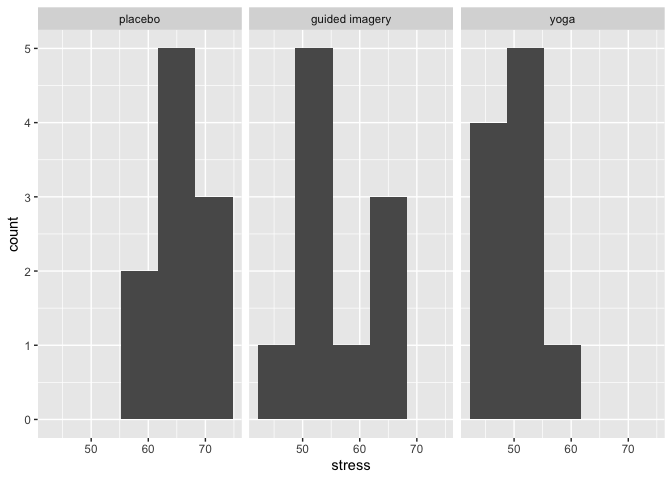
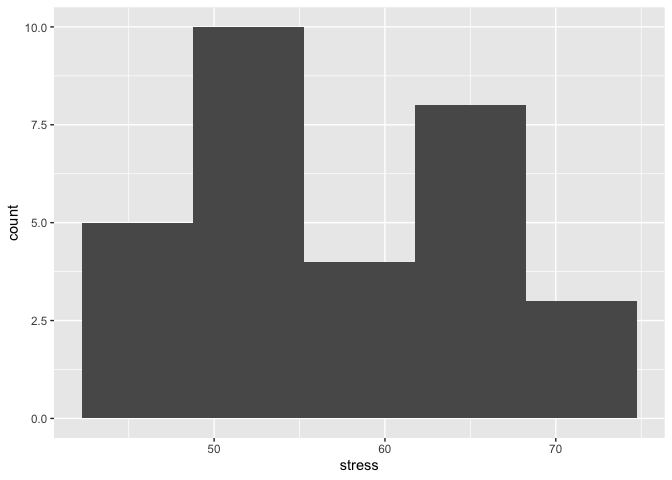
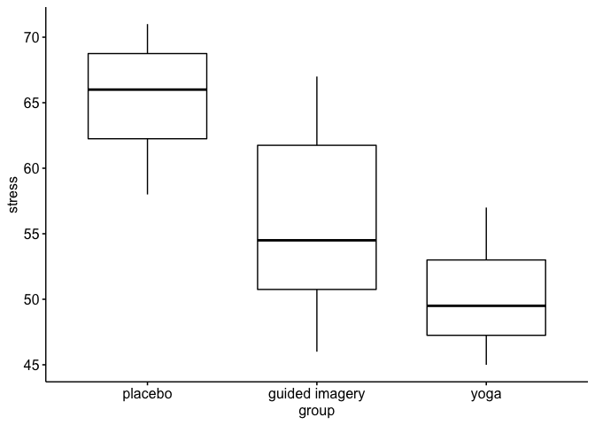
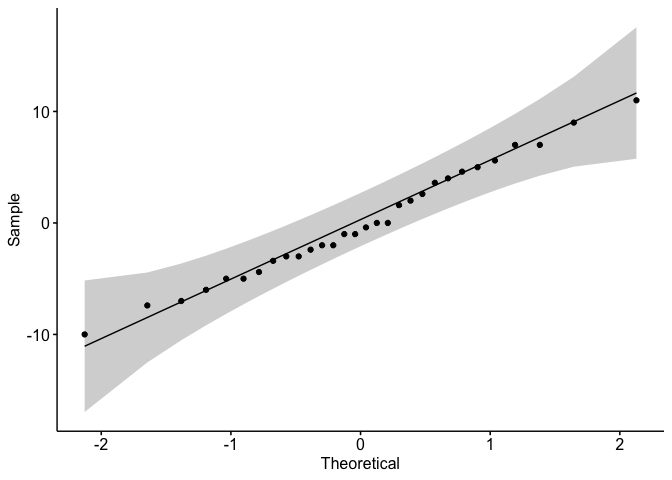
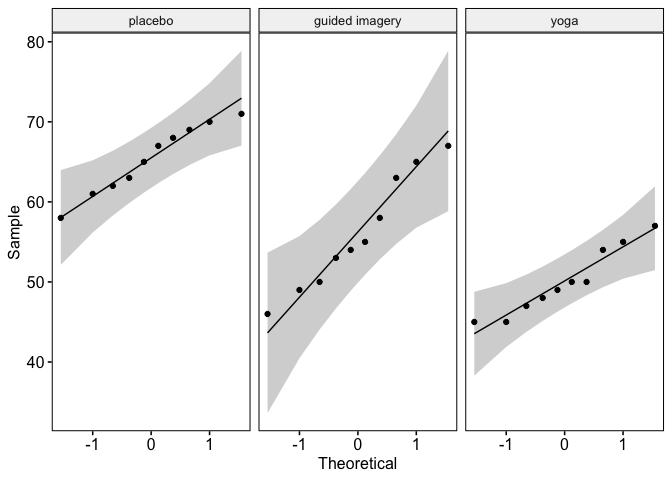
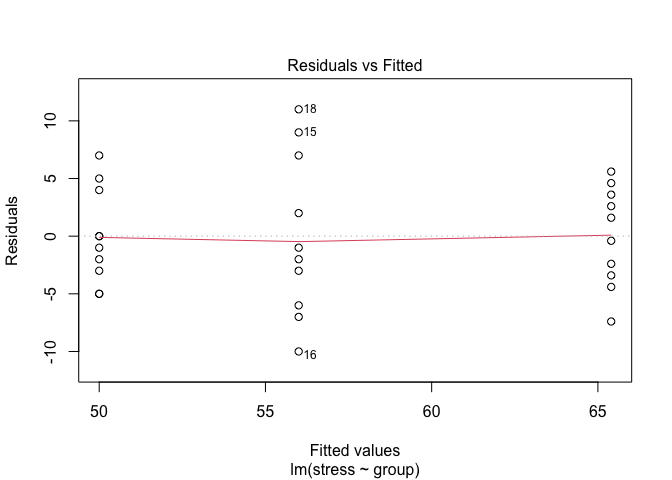

```r
stress_data <- read.csv("anova_data.csv")
glimpse(stress_data)
```

```
## Rows: 30
## Columns: 3
## $ id     <int> 1, 2, 3, 4, 5, 6, 7, 8, 9, 10, 11, 12, 13, 14, 15, 16, 17, 18, …
## $ group  <chr> "yoga", "yoga", "yoga", "yoga", "yoga", "yoga", "yoga", "yoga",…
## $ stress <int> 50, 45, 48, 47, 45, 49, 50, 54, 57, 55, 63, 55, 54, 49, 65, 46,…
```


```r
#changing the variable type of id from integer to character
stress_data$id <- as.character(stress_data$id)
```

#### Overall summary statistics of all variables


```r
summary(stress_data)
```

```
##       id               group               stress     
##  Length:30          Length:30          Min.   :45.00  
##  Class :character   Class :character   1st Qu.:50.00  
##  Mode  :character   Mode  :character   Median :56.00  
##                                        Mean   :57.13  
##                                        3rd Qu.:64.50  
##                                        Max.   :71.00
```


```r
stress_data$group <- fct_relevel(stress_data$group, c("placebo", "guided imagery", "yoga"))

levels(stress_data$group)
```

```
## [1] "placebo"        "guided imagery" "yoga"
```


```r
stat.desc(stress_data$stress)
```

```
##      nbr.val     nbr.null       nbr.na          min          max        range 
##   30.0000000    0.0000000    0.0000000   45.0000000   71.0000000   26.0000000 
##          sum       median         mean      SE.mean CI.mean.0.95          var 
## 1714.0000000   56.0000000   57.1333333    1.5083929    3.0850098   68.2574713 
##      std.dev     coef.var 
##    8.2618080    0.1446057
```

The grand mean stress level is 57.13, which suggests that on average, the stress level of the participants was average. The standard deviation is 8.26, a bit large, the scores are widely spread around the mean.
The standard error of the mean is 1.51, which is a little above 1, this shows that the mean is not so representative of the stress level of the population.

### summary statistics by group


```r
stress_data %>%
        group_by(group) %>%
        get_summary_stats(stress, type = "mean_sd")
```

<div class="kable-table">

|group          |variable |  n| mean|    sd|
|:--------------|:--------|--:|----:|-----:|
|placebo        |stress   | 10| 65.4| 4.300|
|guided imagery |stress   | 10| 56.0| 7.102|
|yoga           |stress   | 10| 50.0| 4.137|

</div>

The mean of the guided imagery group, 56.0 and the yoga group, 50.0 shows that the stress level of the participants were average. Mean of the placebo group, 65.4, is above aberage. The standard deviation of the guided imagery group, 7.1, which is large, the scores are not closely spread around the mean.


```r
#histogram of the predictors
group_hist <- ggplot(stress_data, aes(stress)) +
        geom_histogram(bins = 5) +
        facet_wrap(~ group)
plot(group_hist)
```

<!-- -->

```r
#histogram of the outcome variable
stress_hist <- ggplot(stress_data, aes(stress)) +
        geom_histogram(bins = 5)
plot(stress_hist)
```

<!-- -->
guided imagery - normal
placebo - negatively skewed, there might be outliers
yoga - positively skewed, there might be outliers

## Check Assumptions
### Outliers

#### Boxplots for each group


```r
stress_box <- ggboxplot(stress_data, x = "group", y = "stress")
plot(stress_box)
```

<!-- -->


```r
stress_data %>% 
  #group_by(group) %>%
  identify_outliers("stress")
```

<div class="kable-table">

|id |group | stress|is.outlier |is.extreme |
|:--|:-----|------:|:----------|:----------|

</div>
This shows that there are no outliers.

### Normality assumption

#### Check for the normality of all the groups together


```r
# Build the linear model
model  <- lm(stress ~ group, data = stress_data)
# Create a QQ plot of residuals
ggqqplot(residuals(model))
```

<!-- -->

In the QQ plot, all the points fall approximately along the reference line, so we can assume normality of the data.

#### Check for normality for each group separately


```r
ggqqplot(stress_data, "stress", facet.by = "group")
```

<!-- -->

All the points fall approximately along the reference line, for each group. So we can assume that the data is normally distributed.

### Homogeneity of variance assumption

We can use the residuals versus fits plot to check the homogeneity of variances.


```r
plot(model, 1)
```

<!-- -->

The plot above shows that there is no evident relationships between residuals and fitted values (the mean of each groups). So, we can assume the homogeneity of variances.


```r
stress_anova <- aov(stress ~ group, data = stress_data)
summary.aov(stress_anova)
```

```
##             Df Sum Sq Mean Sq F value   Pr(>F)    
## group        2 1205.1   602.5   21.01 3.15e-06 ***
## Residuals   27  774.4    28.7                     
## ---
## Signif. codes:  0 '***' 0.001 '**' 0.01 '*' 0.05 '.' 0.1 ' ' 1
```

```r
EtaSq(stress_anova)
```

```
##          eta.sq eta.sq.part
## group 0.6087835   0.6087835
```

```r
confint(stress_anova)
```

```
##                         2.5 %    97.5 %
## (Intercept)          61.92510  68.87490
## groupguided imagery -14.31425  -4.48575
## groupyoga           -20.31425 -10.48575
```

The obtained F(2,27) statistic value is 21.008, which is really high. Also the p value is less than 0.05 to show that there are significant differences between group.

The generalized eta squared (effect size) is 0.609. It measures the proportion of the variability in the outcome variable (here stress level) that can be explained in terms of the predictor (here, relaxation techniques). An effect size of 0.61 (61%) means that 61% of the change in the level of stress can be accounted for by the relaxation techniques.


## Planned Contrasts


```r
#placebo vs. other groups
c1 <- c(-2, 1, 1) 
#guided imagery vs yoga
c2 <- c(0, -1, 1)
#placebo vs yoga
c3 <- c(-2, 0, 2)
#placebo vs guided imagery
c4 <- c(-3, 3, 0)
# combine the above 2 contrasts into a matrix
mat <- cbind(c1,c2,c3,c4)

# tell R that the matrix gives the contrasts you want
contrasts(stress_data$group) <- mat

stress_anova_pc <- aov(stress ~ group, data = stress_data)

summary.aov(stress_anova_pc)
```

```
##             Df Sum Sq Mean Sq F value   Pr(>F)    
## group        2 1205.1   602.5   21.01 3.15e-06 ***
## Residuals   27  774.4    28.7                     
## ---
## Signif. codes:  0 '***' 0.001 '**' 0.01 '*' 0.05 '.' 0.1 ' ' 1
```

```r
confint(stress_anova_pc)
```

```
##                 2.5 %     97.5 %
## (Intercept) 55.127099 59.1395676
## groupc1     -5.551955 -2.7147115
## groupc2     -5.457125 -0.5428749
```


```r
### Output the ANOVA result
summary.aov(stress_anova_pc, split=list(group=list("placebo vs. other groups"=1, "guided imagery vs yoga" = 2, "placebo vs. yoga" = 3, "placebo vs. guided imagery" = 4))) 
```

```
##                                     Df Sum Sq Mean Sq F value   Pr(>F)    
## group                                2 1205.1   602.5  21.008 3.15e-06 ***
##   group: placebo vs. other groups    1 1025.1  1025.1  35.740 2.24e-06 ***
##   group: guided imagery vs yoga      1  180.0   180.0   6.276   0.0186 *  
##   group: placebo vs. yoga            1                                    
##   group: placebo vs. guided imagery  1                                    
## Residuals                           27  774.4    28.7                     
## ---
## Signif. codes:  0 '***' 0.001 '**' 0.01 '*' 0.05 '.' 0.1 ' ' 1
```

There is a significant difference between placebo and the other groups, as indicated by the F statistic of 35.74, which is really high and p-value that's less than 0.05.

The difference between guided imagery group and yoga isn't that much with the F statistic of 6.28, and p-value of 0.019.


## Post Hoc Tukey Test


```r
## perform multiple pairwise comparisons

tukey_hsd_test<- PostHocTest(stress_anova_pc, method = "hsd")
tukey_hsd_test
```

```
## 
##   Posthoc multiple comparisons of means : Tukey HSD 
##     95% family-wise confidence level
## 
## $group
##                         diff    lwr.ci      upr.ci   pval    
## guided imagery-placebo  -9.4 -15.33835 -3.46165421 0.0015 ** 
## yoga-placebo           -15.4 -21.33835 -9.46165421  2e-06 ***
## yoga-guided imagery     -6.0 -11.93835 -0.06165421 0.0473 *  
## 
## ---
## Signif. codes:  0 '***' 0.001 '**' 0.01 '*' 0.05 '.' 0.1 ' ' 1
```

There is a big difference between the yoga and placebo group means.


```r
## Use the function get to polynomial contrasts

contrasts(stress_data$group) <- contr.poly(3)
stress_anova_2 <- aov(stress ~ group, data = stress_data)

summary.aov(stress_anova_2, split=list(group=list("linear"=1, "quadratic" = 2))) 
```

```
##                    Df Sum Sq Mean Sq F value   Pr(>F)    
## group               2 1205.1   602.5  21.008 3.15e-06 ***
##   group: linear     1 1185.8  1185.8  41.344 6.87e-07 ***
##   group: quadratic  1   19.3    19.3   0.672     0.42    
## Residuals          27  774.4    28.7                     
## ---
## Signif. codes:  0 '***' 0.001 '**' 0.01 '*' 0.05 '.' 0.1 ' ' 1
```


