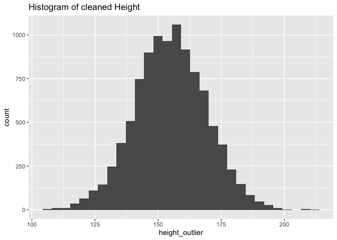

## Load libraries


## Read in the data


```r
data <- read.csv("simulated_data_missing.csv")
```

## Print the data object


```r
glimpse(data)
```

```
## Rows: 10,000
## Columns: 5
## $ id                  <int> 1, 2, 3, 4, 5, 6, 7, 8, 9, 10, 11, 12, 13, 14, 15,…
## $ age_years           <dbl> 38.62033, 35.26406, 55.00560, 21.77767, 49.39280, …
## $ bench_press_max_lbs <dbl> 122.34489, 133.98912, 85.90034, 216.96535, 95.6617…
## $ height_cm           <dbl> 161.0401, 151.7275, 511.0000, 147.2229, 145.1975, …
## $ weight_kg           <dbl> 54.07658, 24.98297, 55.13407, 65.85491, 67.43110, …
```

## Variable Analysis - HEIGHT
* Variable type - Quantitative, Numeric, Continuous


```r
summary(data$height_cm)
```

```
##    Min. 1st Qu.  Median    Mean 3rd Qu.    Max.    NA's 
##    52.0   145.4   154.9   154.9   164.4   511.0      28
```

### Are there outliers?

There appear to be outliers based on the summary statistics above. The minimum and maximum heights which are 52.0cm and 511.0cm are not possible. More exploratory analysis of the variable is needed to see if there are other outliers.

#### Let's plot an histogram of height


```r
hist_height <- ggplot(data = data, aes(height_cm)) + 
                  geom_histogram() +
                ggtitle("Histogram of Uncleaned Height")
plot(hist_height)
```

```
## `stat_bin()` using `bins = 30`. Pick better value with `binwidth`.
```

```
## Warning: Removed 28 rows containing non-finite values (stat_bin).
```

<!-- -->
The histogram indicates that there are values outside the distribution. A boxplot will give more information about the outliers.

#### Let's make a boxplot for height


```r
box_height <- ggplot(data = data, aes(height_cm)) + 
                  geom_boxplot() +
                  ggtitle("Uncleaned Height Data") +
                  coord_flip()
plot(box_height)
```

```
## Warning: Removed 28 rows containing non-finite values (stat_boxplot).
```

<!-- -->
The boxplot shows that there are three extreme values in the height data. It could be that the values were recorded in feet and inches instead of centimeters.
Let's sort the variable in both ascending and descending orders to see the exact values of the extreme values.


```r
#arrange in descending order
head(arrange(data, desc(height_cm)), 10)
```

<div class="kable-table">

|   id| age_years| bench_press_max_lbs| height_cm| weight_kg|
|----:|---------:|-------------------:|---------:|---------:|
|    3|  55.00560|            85.90034|  511.0000|  55.13407|
| 9724|  76.26837|            61.95229|  411.0000|  61.85579|
| 6450|  29.98791|           157.56352|  211.2767|  79.67620|
| 2783|  69.36242|            68.12046|  209.9852| 100.36266|
| 5705|  19.93623|           237.00569|  208.9240|  70.72469|
| 6400|  25.53235|           185.05933|  207.0065|  78.26965|
| 1138|  80.17510|            58.93351|  201.6992|  73.81603|
| 5355|  62.21422|            75.94727|  201.3148|  74.02965|
| 7855|  54.40946|            86.84151|  198.9328|  50.12523|
| 8814|  79.18610|            59.66957|  197.9047|  73.64962|

</div>
Above we see the two extreme values that are outside the maximum of the boxplot, 511cm and 411cm. We are going to assume that they were wrongly recorded in Feet and Inches. So 5ft 11inches = 5ft × 30.48 + 11in × 2.54 = 180.34cm, and 4ft 11inches = 4ft × 30.48 + 11in × 2.54 = 149.86cm. 
Let's recode these variables.


```r
data <- data %>%
          mutate(height_outlier = case_when(
            height_cm == 411 ~ 149.86, 
            height_cm == 511 ~ 180.34,
            TRUE ~ height_cm
          ))
```

Let's arrange the variable in ascending order to see the extreme values on the low end of the boxplot.


```r
#arranging height in ascending order
head(arrange(data, (height_cm)), 10)
```

<div class="kable-table">

|   id| age_years| bench_press_max_lbs| height_cm| weight_kg| height_outlier|
|----:|---------:|-------------------:|---------:|---------:|--------------:|
|   95|  78.73057|            60.01481|  52.00000|  98.29190|       52.00000|
| 2079|  77.75465|            60.76807|  97.18847|  23.13270|       97.18847|
| 6491|  81.55687|            57.93504|  98.93815|  67.38432|       98.93815|
| 8319|  28.28573|           167.04537| 105.23597|  58.74066|      105.23597|
| 4593|  72.89056|            64.82321| 105.29581|  35.93294|      105.29581|
|  929|  53.25763|            88.71969| 107.23587|  28.51314|      107.23587|
|  677|  18.55492|           254.64947| 108.15267|  56.83737|      108.15267|
| 6902|  27.59727|           171.21258| 108.49860|  40.07078|      108.49860|
| 6520|  75.85094|            62.29323| 109.36121|  40.38327|      109.36121|
| 5588|  30.35483|           155.65893| 109.42089|  26.53682|      109.42089|

</div>

Here we see the lowest values is 52.0cm, we can assume that it was also wrongly recorded in feet and inches instead of centimeters. So 5ft 2inches = 5ft × 30.48 + 2in × 2.54 = 157.48cm.
We will also recode this in the data


```r
data <- data %>%
          mutate(height_outlier = case_when(
            height_cm == 411 ~ 149.86, 
            height_cm == 511 ~ 180.34,
            height_cm == 52 ~ 157.48,
            TRUE ~ height_cm
          ))
```

From the sorting in ascending order, we noticed that there are some very short people - 97.18cm and 98.93cm, these values might or might not be logical, but we will be removing these two values from our dataset, and keep the NA values when removing them.


```r
height_no_outliers <- filter(data, is.na(height_outlier) | height_outlier > 100)
```

### Comparing the outlier-cleaned data with the uncleaned data
We will compare the boxplots of the height data with and without outliers.


```r
#boxplots
box_height_no_outlier <- ggplot() + 
                  geom_boxplot(data = height_no_outliers, aes(height_outlier)) +
                  ggtitle("Outlier-Cleaned Height Data") +
                  coord_flip()
#boxplot for outlier-cleaned data
plot(box_height_no_outlier) 
```

```
## Warning: Removed 28 rows containing non-finite values (stat_boxplot).
```

<!-- -->

```r
#boxplot for uncleaned data
plot(box_height) 
```

```
## Warning: Removed 28 rows containing non-finite values (stat_boxplot).
```

<!-- -->

## Are there missing data?
We will check for missing data in our outlier-cleaned data: "height_no_outliers"


```r
summary(height_no_outliers$height_outlier)
```

```
##    Min. 1st Qu.  Median    Mean 3rd Qu.    Max.    NA's 
##   105.2   145.4   154.9   154.9   164.4   211.3      28
```

The summary function shows that there are 28 missing data. We can also use the is.na function to confirm this.

```r
height_no_outliers %>%
  summarise(count = sum(is.na(height_outlier)))
```

<div class="kable-table">

| count|
|-----:|
|    28|

</div>
The is.na function also confirms that there are 28 missing data in our outlier-cleaned height data. 28 missing values out of 9998 data points is a very small portion of the data. So I will remove the people with missing height values leaving us with 9,970 observations.


```r
height_cleaned_data <- drop_na(height_no_outliers, height_outlier)
```

Now, we have a cleaned dataset for height. Let's compare the distribution of the uncleaned and cleaned datasets.


```r
hist_cleaned_height <- ggplot(data = height_cleaned_data, aes(height_outlier)) + 
                  geom_histogram() +
                ggtitle("Histogram of cleaned Height")
plot(hist_cleaned_height)
```

```
## `stat_bin()` using `bins = 30`. Pick better value with `binwidth`.
```

<!-- -->

```r
plot(hist_height)
```

```
## `stat_bin()` using `bins = 30`. Pick better value with `binwidth`.
```

```
## Warning: Removed 28 rows containing non-finite values (stat_bin).
```

<!-- -->
The histogram of cleaned height data suggests a normal distribution as opposed to that of the uncleaned height data which suggested that the distribution of height was leptokurtic.


## Variable Analysis - AGE
* Variable type - Quantitative, Numeric, Continuous

We will use the height cleaned data to analyze the age variable.

```r
summary(height_cleaned_data$age_years)
```

```
##    Min. 1st Qu.  Median    Mean 3rd Qu.    Max.    NA's 
##   18.01   34.96   51.28   51.50   68.16   84.99      23
```

### Are there outliers?

There appear to be no outlier based on the summary statistics above. The minimum and maximum heights which are 18.01years and 84.99 years which seems possible. Let's go further in the exploratory analysis of the variable to be certain that there are no outliers.

#### Let's plot an histogram of age


```r
hist_age <- ggplot(data = height_cleaned_data, aes(age_years)) + 
                  geom_histogram() +
                ggtitle("Histogram of Uncleaned Age")
plot(hist_age)
```

```
## `stat_bin()` using `bins = 30`. Pick better value with `binwidth`.
```

```
## Warning: Removed 23 rows containing non-finite values (stat_bin).
```

<!-- -->
The histogram indicates that there are no values outside the distribution. A boxplot will give more information about this.

#### Let's make a boxplot for age


```r
box_age <- ggplot(data = height_cleaned_data, aes(age_years)) + 
                  geom_boxplot() +
                  ggtitle("Uncleaned Age Data") +
                  coord_flip()
plot(box_age)
```

```
## Warning: Removed 23 rows containing non-finite values (stat_boxplot).
```

<!-- -->
The boxplot shows that there are no extreme values/outliers in the age data. 

## Are there missing data?
We will check for missing age data in our height cleaned data: "height_cleaned_data"


```r
summary(height_cleaned_data$age_years)
```

```
##    Min. 1st Qu.  Median    Mean 3rd Qu.    Max.    NA's 
##   18.01   34.96   51.28   51.50   68.16   84.99      23
```

The summary function shows that there are 23 missing data. We can also use the is.na function to confirm this.


```r
height_cleaned_data %>%
  summarise(count = sum(is.na(age_years)))
```

<div class="kable-table">

| count|
|-----:|
|    23|

</div>

The is.na function also confirms that there are 23 missing data in our cleaned height data. 23 missing values out of 9970 data points is a very small portion of the data. So I will remove the people with missing age values leaving us with 9,947 observations.


```r
age_cleaned_data <- drop_na(height_cleaned_data, age_years)
```

Now, we have a cleaned dataset for age. Let's compare the distribution of the uncleaned and cleaned datasets.


```r
hist_cleaned_age <- ggplot(data = age_cleaned_data, aes(age_years)) + 
                  geom_histogram() +
                ggtitle("Histogram of cleaned Age")
plot(hist_cleaned_age)
```

```
## `stat_bin()` using `bins = 30`. Pick better value with `binwidth`.
```

<!-- -->

```r
plot(hist_age)
```

```
## `stat_bin()` using `bins = 30`. Pick better value with `binwidth`.
```

```
## Warning: Removed 23 rows containing non-finite values (stat_bin).
```

<!-- -->

There is no difference between the histogram of cleaned age data and the uncleaned age data. Both suggest that the distribution of age is uniform.

### Compare the descriptive statistics of the cleaned and uncleaned age data


```r
summary(age_cleaned_data$age_years)
```

```
##    Min. 1st Qu.  Median    Mean 3rd Qu.    Max. 
##   18.01   34.96   51.28   51.50   68.16   84.99
```

```r
summary(height_cleaned_data$age_years)
```

```
##    Min. 1st Qu.  Median    Mean 3rd Qu.    Max.    NA's 
##   18.01   34.96   51.28   51.50   68.16   84.99      23
```

There is also no difference in the mean and median of the cleaned age data and that of uncleaned age data.


## Variable Analysis - WEIGHT
* Variable type - Quantitative, Numeric, Continuous

We will use the age cleaned data to analyze weight.


```r
summary(age_cleaned_data$weight_kg)
```

```
##    Min. 1st Qu.  Median    Mean 3rd Qu.    Max.    NA's 
##   9.055  51.686  61.972  61.931  72.144 170.000      12
```

### Are there outliers?

There appear to be outliers based on the summary statistics above. The minimum weight is 9.1kg which is not plausible, while the max weight is 170kg which is still logical. More exploratory analysis of the variable is needed to see if there are other outliers.

#### Let's plot an histogram of weight


```r
hist_weight <- ggplot(data = age_cleaned_data, aes(weight_kg)) + 
                  geom_histogram() +
                ggtitle("Histogram of Uncleaned Weight")
plot(hist_weight)
```

```
## `stat_bin()` using `bins = 30`. Pick better value with `binwidth`.
```

```
## Warning: Removed 12 rows containing non-finite values (stat_bin).
```

<!-- -->
The histogram indicates that there are values outside the distribution. A boxplot will give more information about the outliers.

#### Let's make a boxplot for weight


```r
box_weight <- ggplot(data = age_cleaned_data, aes(weight_kg)) + 
                  geom_boxplot() +
                  ggtitle("Boxplot of Uncleaned Weight Data") +
                  coord_flip()
plot(box_weight)
```

```
## Warning: Removed 12 rows containing non-finite values (stat_boxplot).
```

<!-- -->
The boxplot shows that there are three extreme values in the weight data. It could be that the participants were measured in pounds, or they are obese.
Let's sort the variable in both ascending and descending orders to see the exact values of the extreme values.


```r
#arrange in descending order
head(arrange(age_cleaned_data, desc(weight_kg)), 10)
```

<div class="kable-table">

|   id| age_years| bench_press_max_lbs| height_cm| weight_kg| height_outlier|
|----:|---------:|-------------------:|---------:|---------:|--------------:|
|  114|  34.00692|           138.94230|  173.0045|  170.0000|       173.0045|
|   69|  34.42120|           137.27004|  119.4490|  150.0000|       119.4490|
| 9689|  46.64394|           101.29932|  163.4220|  130.0000|       163.4220|
| 7569|  61.91067|            76.31964|  182.5638|  117.9219|       182.5638|
| 8154|  22.51674|           209.84392|  170.9847|  116.3617|       170.9847|
|  911|  60.52658|            78.06488|  173.6261|  116.1635|       173.6261|
| 2345|  27.54773|           171.52050|  167.3413|  114.2602|       167.3413|
| 6174|  79.72294|            59.26776|  188.6197|  113.1065|       188.6197|
| 1527|  43.91799|           107.58689|  150.1467|  111.0250|       150.1467|
| 1963|  65.92186|            71.67577|  179.0628|  110.9338|       179.0628|

</div>

Above we see the three extreme values that are outside the maximum of the boxplot, 170kg, 150kg and 130kg. We are going to assume that they were wrongly recorded in pounds instead of kilograms. So 170lbs = 170/2.205 = 77.11kg, 150lbs = 150/2.205 = 68.04kg, and 130lbs = 130/2.205 = 58.97kg.
Let's recode these variables.


```r
age_cleaned_data <- age_cleaned_data %>%
                mutate(weight_outlier = case_when(
            weight_kg == 170 ~ 77.11, 
            weight_kg == 150 ~ 68.04,
            weight_kg == 130 ~ 58.97,
            TRUE ~ weight_kg
          ))
```

Let's arrange the variable in ascending order to see the extreme values on the low end of the boxplot.


```r
#arranging height in ascending order
head(arrange(age_cleaned_data, (weight_outlier)), 50)
```

<div class="kable-table">

|   id| age_years| bench_press_max_lbs| height_cm| weight_kg| height_outlier| weight_outlier|
|----:|---------:|-------------------:|---------:|---------:|--------------:|--------------:|
| 8588|  73.39273|            64.37967|  146.4622|  9.055479|       146.4622|       9.055479|
| 8671|  81.52115|            57.96042|  116.8438|  9.527783|       116.8438|       9.527783|
| 4850|  27.65947|           170.82759|  135.8115|  9.847665|       135.8115|       9.847665|
| 9634|  55.26341|            85.49962|  128.3686|  9.876399|       128.3686|       9.876399|
| 5291|  56.13930|            84.16563|  146.8725| 10.192736|       146.8725|      10.192736|
| 5068|  52.14240|            90.61724|  135.8064| 11.442282|       135.8064|      11.442282|
| 1329|  39.44335|           119.79205|  146.3271| 11.476698|       146.3271|      11.476698|
| 4059|  59.19218|            79.82474|  115.9540| 12.955322|       115.9540|      12.955322|
| 5019|  36.05194|           131.06091|  144.2707| 14.437548|       144.2707|      14.437548|
| 5223|  75.18072|            62.84856|  124.7141| 14.976176|       124.7141|      14.976176|
| 9603|  22.73999|           207.78370|  137.1318| 15.167269|       137.1318|      15.167269|
| 4858|  34.41867|           137.28015|  140.1364| 16.126422|       140.1364|      16.126422|
| 6161|  84.24404|            56.08705|  144.3311| 17.055235|       144.3311|      17.055235|
| 2229|  25.78733|           183.22949|  147.1309| 17.125954|       147.1309|      17.125954|
|  403|  42.16401|           112.06239|  153.6772| 17.203622|       153.6772|      17.203622|
| 2513|  76.92031|            61.42721|  141.9744| 17.264315|       141.9744|      17.264315|
|  846|  84.16058|            56.14268|  134.4169| 17.340237|       134.4169|      17.340237|
| 2942|  75.92146|            62.23536|  119.3718| 17.609254|       119.3718|      17.609254|
| 7164|  80.66325|            58.57686|  141.6253| 18.122800|       141.6253|      18.122800|
| 8504|  40.15006|           117.68350|  144.7427| 18.132542|       144.7427|      18.132542|
| 9606|  25.85861|           182.72444|  157.9440| 18.316605|       157.9440|      18.316605|
| 5615|  53.34574|            88.57314|  145.0290| 18.691024|       145.0290|      18.691024|
| 6604|  22.94527|           205.92483|  146.1959| 18.966369|       146.1959|      18.966369|
| 7032|  40.69978|           116.09399|  129.1741| 19.159693|       129.1741|      19.159693|
| 8259|  20.00177|           236.22912|  135.9333| 19.258038|       135.9333|      19.258038|
| 8229|  78.29349|            60.34984|  137.2196| 19.848053|       137.2196|      19.848053|
| 1873|  70.61500|            66.91213|  125.3776| 19.930697|       125.3776|      19.930697|
| 7950|  84.68838|            55.79278|  126.8782| 20.153928|       126.8782|      20.153928|
| 3752|  30.46051|           155.11886|  160.5040| 20.516032|       160.5040|      20.516032|
| 3342|  63.07545|            74.91029|  159.0355| 20.726510|       159.0355|      20.726510|
| 8310|  65.78157|            71.82863|  144.7861| 21.071382|       144.7861|      21.071382|
| 9406|  53.35134|            88.56384|  153.1580| 21.145060|       153.1580|      21.145060|
| 3346|  43.49141|           108.64214|  130.0273| 21.206974|       130.0273|      21.206974|
| 6355|  38.53908|           122.60282|  124.8428| 21.248963|       124.8428|      21.248963|
| 9999|  64.25639|            73.53355|  144.9659| 21.253299|       144.9659|      21.253299|
| 8653|  67.39984|            70.10402|  135.0968| 21.669376|       135.0968|      21.669376|
|   30|  36.60749|           129.07194|  156.6972| 22.055432|       156.6972|      22.055432|
| 1772|  73.10667|            64.63158|  148.7162| 22.198145|       148.7162|      22.198145|
| 6167|  54.49599|            86.70363|  144.8065| 22.294763|       144.8065|      22.294763|
| 6451|  83.24722|            56.75865|  144.1852| 22.445154|       144.1852|      22.445154|
| 3561|  26.78562|           176.40060|  167.8433| 22.445397|       167.8433|      22.445397|
| 9494|  64.45019|            73.31243|  145.8338| 22.540258|       145.8338|      22.540258|
| 1640|  72.81001|            64.89492|  140.9847| 22.603462|       140.9847|      22.603462|
| 4724|  82.17944|            57.49613|  157.6803| 22.736647|       157.6803|      22.736647|
| 8025|  33.60543|           140.60227|  131.1479| 22.837522|       131.1479|      22.837522|
| 9000|  56.03507|            84.32219|  128.9352| 22.913703|       128.9352|      22.913703|
| 1305|  38.52022|           122.66284|  136.7252| 23.079466|       136.7252|      23.079466|
| 2628|  62.97900|            75.02500|  134.3708| 23.102544|       134.3708|      23.102544|
| 1428|  54.00880|            87.48574|  144.2951| 23.392202|       144.2951|      23.392202|
|  312|  76.83853|            61.49259|  148.0855| 23.646734|       148.0855|      23.646734|

</div>

Here we see the lowest values is 9kg and the least 50 values were barely above 23kg, there is no logical explanation for these. It could be that the decimal points were wrongly placed, and/or most of them were measured in pounds and not kilograms. we will leave the values like that but we will be removing the four values that are less than 10kg from our dataset, and keep the NA values when removing them.


```r
weight_no_outliers <- filter(age_cleaned_data, is.na(weight_outlier) | weight_outlier > 10)
```

### Comparing the outlier-cleaned data with the uncleaned data
We will compare the boxplots of the height data with and without outliers.


```r
#boxplots
box_weight_no_outlier <- ggplot() + 
                  geom_boxplot(data = weight_no_outliers, aes(weight_outlier)) +
                  ggtitle("Boxplot of Outlier-Cleaned Weight Data") +
                  coord_flip()
#boxplot for outlier-cleaned data
plot(box_weight_no_outlier) 
```

```
## Warning: Removed 12 rows containing non-finite values (stat_boxplot).
```

<!-- -->

```r
#boxplot for uncleaned data
plot(box_weight) 
```

```
## Warning: Removed 12 rows containing non-finite values (stat_boxplot).
```

<!-- -->

## Are there missing data?
We will check for missing data in our outlier-cleaned data: "weight_no_outliers"


```r
summary(weight_no_outliers$weight_outlier)
```

```
##    Min. 1st Qu.  Median    Mean 3rd Qu.    Max.    NA's 
##   10.19   51.70   61.97   61.93   72.14  117.92      12
```

The summary function shows that there are 12 missing data. We can also use the is.na function to confirm this.


```r
weight_no_outliers %>%
  summarise(count = sum(is.na(weight_outlier)))
```

<div class="kable-table">

| count|
|-----:|
|    12|

</div>

The is.na function also confirms that there are 12 missing data in our outlier-cleaned weight data. 12 missing values out of 9943 data points is a very small portion of the data. So I will remove the people with missing weight values leaving us with 9,931 observations.


```r
weight_cleaned_data <- drop_na(weight_no_outliers, weight_outlier)
```

Now, we have a cleaned dataset for weight. Let's compare the distribution of the uncleaned and cleaned datasets.


```r
hist_cleaned_weight <- ggplot(data = weight_cleaned_data, aes(weight_outlier)) + 
                  geom_histogram() +
                ggtitle("Histogram of cleaned Weight")
plot(hist_cleaned_weight)
```

```
## `stat_bin()` using `bins = 30`. Pick better value with `binwidth`.
```

<!-- -->

```r
plot(hist_weight)
```

```
## `stat_bin()` using `bins = 30`. Pick better value with `binwidth`.
```

```
## Warning: Removed 12 rows containing non-finite values (stat_bin).
```

<!-- -->
The histogram of cleaned weight data suggests a normal distribution as opposed to that of the uncleaned weight data which suggested that the distribution of height was somewhat leptokurtic.


## Variable Analysis - BENCH PRESS MAX
* Variable type - Quantitative, Numeric, Continuous

We will use the weight cleaned data to analyze bench press max


```r
summary(weight_cleaned_data$bench_press_max_lbs)
```

```
##    Min. 1st Qu.  Median    Mean 3rd Qu.    Max.    NA's 
##   55.59   69.33   92.16  109.25  135.27  500.00      16
```

### Are there outliers?

There appear to be outliers based on the summary statistics above. The maximum bench press max which is 500lbs might not be possible. More exploratory analysis of the variable is needed to see if there are outliers.

#### Let's plot an histogram of bench press max


```r
hist_bench_press <- ggplot(data = weight_cleaned_data, aes(bench_press_max_lbs)) + 
                  geom_histogram() +
                ggtitle("Histogram of Uncleaned Bench Press Max")
plot(hist_bench_press)
```

```
## `stat_bin()` using `bins = 30`. Pick better value with `binwidth`.
```

```
## Warning: Removed 16 rows containing non-finite values (stat_bin).
```

<!-- -->
The histogram indicates that there are values outside the distribution. A boxplot will give more information about the outliers.

#### Let's make a boxplot for bench press max


```r
box_bench_press <- ggplot(data = weight_cleaned_data, aes(bench_press_max_lbs)) + 
                  geom_boxplot() +
                  ggtitle("Boxplot of Uncleaned Bench Press Max Data") +
                  coord_flip()
plot(box_bench_press)
```

```
## Warning: Removed 16 rows containing non-finite values (stat_boxplot).
```

<!-- -->
The boxplot shows that there are two extreme values in the bench press data. It could be that the values were wrongly recorded or the participants were actually very strong.
Let's sort the variable in both ascending and descending orders to see the exact values of the extreme values.


```r
#arrange in descending order
head(arrange(weight_cleaned_data, desc(bench_press_max_lbs)), 10)
```

<div class="kable-table">

|   id| age_years| bench_press_max_lbs| height_cm| weight_kg| height_outlier| weight_outlier|
|----:|---------:|-------------------:|---------:|---------:|--------------:|--------------:|
|  280|  35.62033|            500.0000|  163.9153|  45.17775|       163.9153|       45.17775|
|  248|  20.74785|            350.0000|  177.9113|  64.96333|       177.9113|       64.96333|
|  193|  31.57183|            270.0000|  182.1969|  60.52423|       182.1969|       60.52423|
| 3726|  18.01334|            262.3057|  162.1875|  66.51877|       162.1875|       66.51877|
| 8509|  18.01821|            262.2346|  160.1258|  63.60764|       160.1258|       63.60764|
|  516|  18.02647|            262.1146|  163.9895|  58.16195|       163.9895|       58.16195|
| 8711|  18.02713|            262.1050|  161.6748|  74.86311|       161.6748|       74.86311|
| 7606|  18.02924|            262.0742|  159.3542|  37.45409|       159.3542|       37.45409|
|  903|  18.03007|            262.0622|  129.8263|  77.26702|       129.8263|       77.26702|
| 7356|  18.03094|            262.0496|  181.5124|  79.42527|       181.5124|       79.42527|

</div>

Here we see the two extreme values that are outside the maximum of the boxplot, 500lbs, 350lbs and 270lbs. We are going to assume that they are very strong and remove them from our observations. We will be left with 9928 observations.


```r
bench_no_outliers <- filter(weight_cleaned_data, is.na(bench_press_max_lbs) | bench_press_max_lbs < 270)
```

Let's arrange the variable in ascending order to see the extreme values on the low end of the boxplot.


```r
#arranging height in ascending order
head(arrange(weight_cleaned_data, (bench_press_max_lbs)), 10)
```

<div class="kable-table">

|   id| age_years| bench_press_max_lbs| height_cm| weight_kg| height_outlier| weight_outlier|
|----:|---------:|-------------------:|---------:|---------:|--------------:|--------------:|
| 1092|  84.99019|            55.59465|  145.9707|  48.96224|       145.9707|       48.96224|
| 3954|  84.97523|            55.60444|  162.0701|  72.92510|       162.0701|       72.92510|
| 1134|  84.97474|            55.60476|  159.3382|  43.96873|       159.3382|       43.96873|
| 7232|  84.97016|            55.60776|  152.1495|  70.38246|       152.1495|       70.38246|
|  723|  84.96809|            55.60911|  165.6570|  63.09319|       165.6570|       63.09319|
| 2434|  84.96796|            55.60919|  158.3583|  61.79362|       158.3583|       61.79362|
| 5405|  84.96153|            55.61340|  155.9181|  54.13042|       155.9181|       54.13042|
| 3016|  84.96151|            55.61342|  166.7351|  69.88470|       166.7351|       69.88470|
| 7004|  84.95320|            55.61886|  157.9361|  56.23958|       157.9361|       56.23958|
| 3371|  84.94801|            55.62226|  171.2408|  78.59010|       171.2408|       78.59010|

</div>

We can see here that there is no extreme low value in the bench press max variable.

### Comparing the outlier-cleaned data with the uncleaned data
We will compare the boxplots of the bench press data with and without outliers.


```r
#boxplots
box_bench_press_no_outlier <- ggplot() + 
                  geom_boxplot(data = bench_no_outliers, aes(bench_press_max_lbs)) +
                  ggtitle("Outlier-Cleaned Bench Press Data") +
                  coord_flip()
#boxplot for outlier-cleaned data
plot(box_bench_press_no_outlier) 
```

```
## Warning: Removed 16 rows containing non-finite values (stat_boxplot).
```

<!-- -->

```r
#boxplot for uncleaned data
plot(box_bench_press) 
```

```
## Warning: Removed 16 rows containing non-finite values (stat_boxplot).
```

<!-- -->

## Are there missing data?
We will check for missing data in our outlier-cleaned data: "bench_no_outliers"


```r
summary(bench_no_outliers$bench_press_max_lbs)
```

```
##    Min. 1st Qu.  Median    Mean 3rd Qu.    Max.    NA's 
##   55.59   69.33   92.15  109.17  135.16  262.31      16
```

The summary function shows that there are 16 missing data. We can also use the is.na function to confirm this.


```r
bench_no_outliers %>%
  summarise(count = sum(is.na(bench_press_max_lbs)))
```

<div class="kable-table">

| count|
|-----:|
|    16|

</div>

The is.na function also confirms that there are 16 missing data in our outlier-cleaned bench press max data. 16 missing values out of 9928 data points is a very small portion of the data. So I will remove the people with missing bench press max values leaving us with 9,912 observations.


```r
bench_cleaned_data <- drop_na(bench_no_outliers, bench_press_max_lbs)
```

Now, we have a cleaned dataset for bench press max. Let's compare the distribution of the uncleaned and cleaned datasets.


```r
hist_cleaned_bench <- ggplot(data = bench_cleaned_data, aes(bench_press_max_lbs)) + 
                  geom_histogram() +
                ggtitle("Histogram of cleaned bench press max")
plot(hist_cleaned_bench)
```

```
## `stat_bin()` using `bins = 30`. Pick better value with `binwidth`.
```

<!-- -->

```r
plot(hist_bench_press)
```

```
## `stat_bin()` using `bins = 30`. Pick better value with `binwidth`.
```

```
## Warning: Removed 16 rows containing non-finite values (stat_bin).
```

<!-- -->
The histogram of cleaned bench press max data suggests a more diverse poisson distribution as opposed to that of the uncleaned bench press max data.

### Compare the descriptive statistics of the cleaned and uncleaned bench press max data


```r
summary(weight_cleaned_data$bench_press_max_lbs)
```

```
##    Min. 1st Qu.  Median    Mean 3rd Qu.    Max.    NA's 
##   55.59   69.33   92.16  109.25  135.27  500.00      16
```

```r
summary(bench_cleaned_data$bench_press_max_lbs)
```

```
##    Min. 1st Qu.  Median    Mean 3rd Qu.    Max. 
##   55.59   69.33   92.15  109.17  135.16  262.31
```
There is also little to no difference between the mean and median of the cleaned and uncleaned bench press data.
