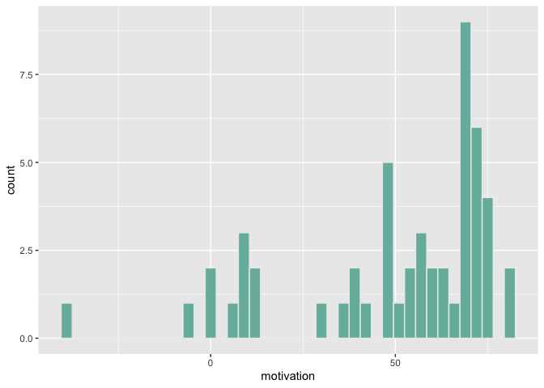
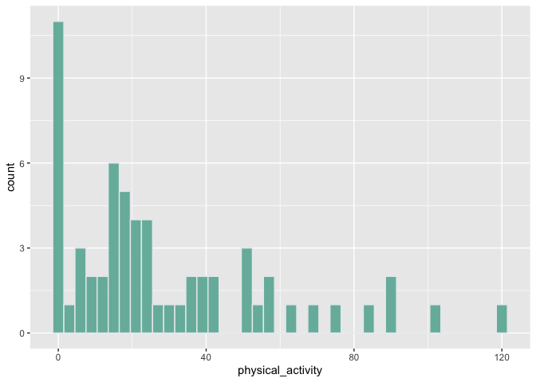
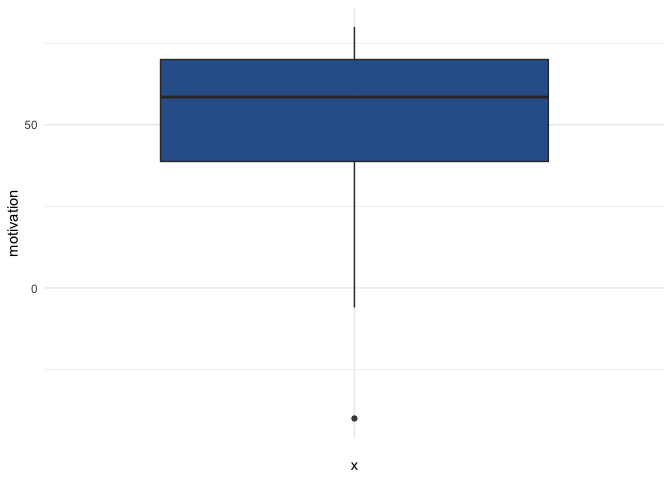
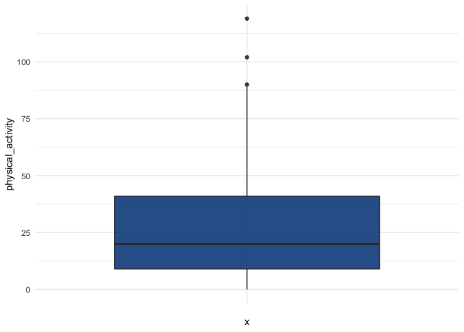
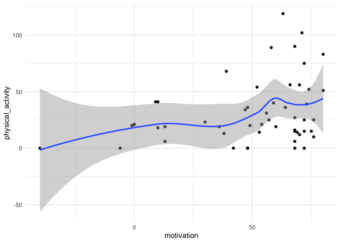

### Import necessary libraries


## Read in the dataset


```r
df <- read.csv("BIO_OlderAdultPilot_6000_SA.csv")
head(df)
```

<div class="kable-table">

|  X| ID|Survey | Stren| Mod| Mild| Motive1| Motive2| Motive3| Motive4| Motive5| Motive6| Motive7| Motive8| Motive9| Motive10| Motive11| Motive12| Motive13| Motive14| Motive15| Motive16| Motive17| Motive18| Motive19| Barr1| Barr2| Barr3| Barr4| Barr5| Barr6| Barr7| Barr8| Barr9| Barr10| Barr11| Barr12| Barr13| Barr14| Barr15| Barr16| Barr17| Barr18| Barr19| Barr20| Sex| Month| Year| Educat|EducatOther | Marist| Income| Employ|
|--:|--:|:------|-----:|---:|----:|-------:|-------:|-------:|-------:|-------:|-------:|-------:|-------:|-------:|--------:|--------:|--------:|--------:|--------:|--------:|--------:|--------:|--------:|--------:|-----:|-----:|-----:|-----:|-----:|-----:|-----:|-----:|-----:|------:|------:|------:|------:|------:|------:|------:|------:|------:|------:|------:|---:|-----:|----:|------:|:-----------|------:|------:|------:|
|  1| 62|works  |     0|   0|    2|       0|       4|       4|       4|       0|       0|       4|       4|       0|        4|        0|        0|        4|        4|        4|        0|        4|        4|        0|     1|     1|     1|     1|     1|     1|     1|     4|     1|      1|      1|      1|      1|      1|      1|      1|      1|      1|      1|      1|   0|     3| 1934|      2|NA          |      2|      4|      4|
|  2| 63|works  |     3|   0|    3|       3|       3|       3|       3|       0|       0|       2|       3|       0|        3|        0|        0|        1|        3|        3|        0|        3|        3|        0|     2|     4|     1|     2|     4|     2|     2|     2|     2|      2|      2|      2|      4|      2|      4|      2|      2|      2|      2|      2|   1|     9| 1939|      3|NA          |      2|      5|      4|
|  3| 69|works  |     0|   3|    0|       0|       0|       4|       4|       0|       0|       0|       4|       0|        4|        0|        0|        0|        4|        4|        0|        0|        4|        0|     1|     1|     1|     1|     1|     1|     1|     1|     1|      1|      1|      1|      1|      1|      1|      1|      1|      1|      1|      1|   1|     7| 1933|      4|NA          |      5|      5|      4|
|  4| 70|works  |     0|   0|    0|       0|       2|       4|       2|       0|       0|       0|       4|       0|        4|        0|        0|        0|        4|        4|        0|        2|        4|        0|     1|     4|     1|     2|     2|     2|     3|    NA|     1|      1|      1|      1|      2|      2|      2|      1|      1|      1|      2|      1|  NA|     8| 1930|      4|NA          |      5|     NA|      4|
|  5| 71|works  |     0|   2|    7|       0|       4|       4|       2|       0|       0|       0|       4|       0|        4|        0|        0|        0|        4|        2|        2|        2|        4|        0|     2|     1|     1|     1|     1|     4|     1|     1|     1|      1|      1|      1|      3|      1|      1|      1|      1|      1|      1|      1|   1|     1| 1933|      3|NA          |      2|      8|      4|
|  6| 72|works  |     0|   2|    3|       4|       4|       4|       3|       0|       3|       2|       4|       0|        3|        2|        0|        3|        4|        4|        2|        2|        3|        0|     1|     4|     1|     1|     2|     1|     2|     2|     1|      1|      2|      1|      4|      2|      2|      1|      1|      1|      1|      1|   1|    11| 1942|      4|NA          |      2|      5|      4|

</div>

### Create the "motivation" and "physical_activity" variables


```r
df <- df %>% 
  mutate(motivation = ((Motive5 + Motive9 + Motive12 + Motive19)*-3) + ((Motive1 + Motive6 + Motive11 + Motive16)*-2) + ((Motive2 + Motive7 + Motive13)*-1) + ((Motive3 + Motive8 + Motive14 + Motive17)*2) + ((Motive4 + Motive10 + Motive15 + Motive18)*3))
```


```r
df <- df %>% 
  mutate(physical_activity = (9*Stren) + (5*Mod) + (3*Mild))
```

## Part 1 - State a research question and state the independent and dependent variables
        * State and describe the variables
        
The research question to be answered is: What relationship exists between the degree of physical activity and motivation to exercise among older adults living in NL?

* Independent variable - Motivation to exercise (motivation)
This score is calculated 
* Dependent variable - degree of physical activity (physical_activity)

## Part 2 - Describe the sample
        * Discuss the appropriate descriptive statistics (i.e., frequencies, mean, standard deviation, etc.) of socio-demographic variables.

### Gender


```r
df <- df %>% 
          mutate(sex_cat = case_when(
            Sex == 0 ~ "male", 
            Sex == 1 ~ "female", 
            TRUE ~ "other"
          ))
table(df$sex_cat)
```

```
## 
## female   male  other 
##     35     26      1
```
The number of female older adults is 35 which represents 56.5% of the total number of participants. This sample is representative of the population, with more female older adults in NL (https://nl.communityaccounts.ca/profiles.asp?_=vb7En4WVgbOxz7ZjS5bIzKufwJKllbfAtYyDzZKykcnFnw__)


### Highest Level of Education


```r
df <- df %>% 
          mutate(edu_cat = case_when(
            Educat == 1 ~ "elementary_school", 
            Educat == 2 ~ "high_school",
            Educat == 3 ~ "some_sec_education",
            Educat == 4 ~ "diploma_or_cert",
            Educat == 5 ~ "university",
            Educat == 6 ~ "graduate",
            Educat == 7 ~ "other",
            TRUE ~ "other"
          ))
table(df$edu_cat)
```

```
## 
##    diploma_or_cert  elementary_school           graduate        high_school 
##                 18                 10                  5                 14 
##              other some_sec_education         university 
##                  1                  7                  7
```

More of the participants had education up till diploma or certificate level.

### Year of Birth


```r
df <- df %>% 
        mutate(age = 2016 - Year)
round(stat.desc(df$age),0)
```

```
##      nbr.val     nbr.null       nbr.na          min          max        range 
##           62            0            0           69           97           28 
##          sum       median         mean      SE.mean CI.mean.0.95          var 
##         5003           80           81            1            2           58 
##      std.dev     coef.var 
##            8            0
```

Mean age is 81 with SD of 8, which shows that the values are closely spread to the mean. The SE is relatively small, which shows that the sample mean is representative of the population.

### Marital Status


```r
df <- df %>% 
          mutate(marist_cat = case_when(
            Marist == 1 ~ "single_never_married", 
            Marist == 2 ~ "married",
            Marist == 3 ~ "separated",
            Marist == 4 ~ "divorced",
            Marist == 5 ~ "widowed_and_single",
            Marist == 6 ~ "widowed_and_remarried",
            TRUE ~ "other"
          ))
table(df$marist_cat)
```

```
## 
##              divorced               married                 other 
##                     1                    43                     1 
##             separated widowed_and_remarried    widowed_and_single 
##                     1                     1                    15
```

A higher number of the participants are married.

### Annual Household Income


```r
df <- df %>% 
          mutate(income_cat = case_when(
            Income == 1 ~ "less_than_10k", 
            Income == 2 ~ "10k_to_19k",
            Income == 3 ~ "20k_to_29k",
            Income == 4 ~ "30k_to_39k",
            Income == 5 ~ "40k_to_49k",
            Income == 6 ~ "50k_to_59k",
            Income == 7 ~ "60k_to_79k",
            Income == 8 ~ "80k_to_99k",
            Income == 9 ~ "over_100k",
            TRUE ~ "other"
          ))
table(df$income_cat)
```

```
## 
##    10k_to_19k    20k_to_29k    30k_to_39k    40k_to_49k    50k_to_59k 
##             5             5             8            14             3 
##    60k_to_79k    80k_to_99k less_than_10k         other     over_100k 
##             3             5             1            15             3
```

Most of the participants are earning an average income annually.

### Employment Status


```r
df <- df %>% 
          mutate(employ_cat = case_when(
            Employ == 1 ~ "full_time", 
            Employ == 2 ~ "part_time", 
            Employ == 3 ~ "unemployed", 
            Employ == 4 ~ "retired",
            TRUE ~ "other"
          ))
table(df$employ_cat)
```

```
## 
##  full_time      other  part_time    retired unemployed 
##          2          2          3         53          2
```

53 out of the 62 participants were retired.

## Part 3 - Explore the data

### Histogram of Motivation


```r
motiv_hist <- df %>%
  ggplot(aes(x=motivation)) +
    geom_histogram(binwidth=3, fill="#69b3a2", color="#e9ecef", alpha=0.9)
motiv_hist
```

```
## Warning: Removed 10 rows containing non-finite values (stat_bin).
```

<!-- -->
The distribution of motivation looks like a multimodal distribution with seems to suggest that the participants had several patterns of motivation scores. It also looks negatively skewed with more motivation scores clustered around the high end of the scale.

### Histogram for Physical activity 


```r
pa_hist <- df %>%
  ggplot(aes(x=physical_activity)) +
    geom_histogram(binwidth=3, fill="#69b3a2", color="#e9ecef", alpha=0.9)
pa_hist
```

```
## Warning: Removed 1 rows containing non-finite values (stat_bin).
```

<!-- -->
The distribution of physical activity looks positively skewed with more physical activity scores clustered around the low end of the scale.

### Motivation boxplot 


```r
motiv_outlier <- ggplot(df) +
  aes(x = "", y = motivation) +
  geom_boxplot(fill = "#0c4c8a", alpha = 0.9) +
  theme_minimal()
motiv_outlier
```

```
## Warning: Removed 10 rows containing non-finite values (stat_boxplot).
```

<!-- -->

There is eveidence of a potential outlier on the minimum of the motivation boxplot. A participant had a very low motivation score, that's different from other participants.

### Physical activity boxplot


```r
pa_outlier <- ggplot(df) +
  aes(x = "", y = physical_activity) +
  geom_boxplot(fill = "#0c4c8a", alpha = 0.9) +
  theme_minimal()
pa_outlier
```

```
## Warning: Removed 1 rows containing non-finite values (stat_boxplot).
```

<!-- -->
There is evidence of potential outlier above the maximum for physical activity. Three of the participants had a very high degree of physical activity as compared to others.

### descriptive statistics of motivation


```r
round(stat.desc(df$motivation, norm = TRUE), 2)
```

```
##      nbr.val     nbr.null       nbr.na          min          max        range 
##        52.00         1.00        10.00       -40.00        80.00       120.00 
##          sum       median         mean      SE.mean CI.mean.0.95          var 
##      2591.00        58.50        49.83         3.79         7.62       748.66 
##      std.dev     coef.var     skewness     skew.2SE     kurtosis     kurt.2SE 
##        27.36         0.55        -1.21        -1.83         0.74         0.57 
##   normtest.W   normtest.p 
##         0.85         0.00
```

The mean and standard deviation of the motivation score is 49.83 and 27.36, this shows that there is the motivation scores of the participants are widely spread away from the mean.

The SE of 3.79, being relatively big, gives us an indication that our mean motivation is not relatively close to the true mean motivation of our overall population.

### descriptive statistics of physical activity


```r
round(stat.desc(df$physical_activity, norm = TRUE),2)
```

```
##      nbr.val     nbr.null       nbr.na          min          max        range 
##        61.00        11.00         1.00         0.00       119.00       119.00 
##          sum       median         mean      SE.mean CI.mean.0.95          var 
##      1760.00        20.00        28.85         3.60         7.21       792.56 
##      std.dev     coef.var     skewness     skew.2SE     kurtosis     kurt.2SE 
##        28.15         0.98         1.22         1.99         0.92         0.77 
##   normtest.W   normtest.p 
##         0.87         0.00
```

The mean and standard deviation of the physical activity score is 28.85 and 28.15, this shows that there is the degree of physical activity of the participants are widely spread away from the mean.

The SE of 3.60, being relatively big, gives us an indication that our mean physical activity is not relatively close to the true mean physical activity of our overall population.

## Part 4 - Correlation

### Scatterplot


```r
motiv_pa_scatter <- ggplot(df) +
  aes(x = motivation, y = physical_activity) +
  geom_point(fill = "#0c4c8a", alpha = 0.9) +
  geom_smooth() +
  theme_minimal()
motiv_pa_scatter
```

```
## `geom_smooth()` using method = 'loess' and formula 'y ~ x'
```

```
## Warning: Removed 11 rows containing non-finite values (stat_smooth).
```

```
## Warning: Removed 11 rows containing missing values (geom_point).
```

<!-- -->

The graph shows that the higher the motivation to exercise, the higher the degree of physical activity recorded. Most of the participants are clustered around this area. Only one participant falls in the low motivation to exercise and low physical activity area. 

### Pearson correlation


```r
cor(df$motivation, df$physical_activity, use = "na.or.complete", method = "pearson")
```

```
## [1] 0.2963659
```

The Pearson correlation coefficient is 0.296, which show that there is a positive linear relationship between motivation and physical activity, but this relationship is small.

Pearson method was used because it measures the linear relationship between two continuous variables, while spearman measures the relationship between two ordinal variables (https://towardsdatascience.com/clearly-explained-pearson-v-s-spearman-correlation-coefficient-ada2f473b8).
