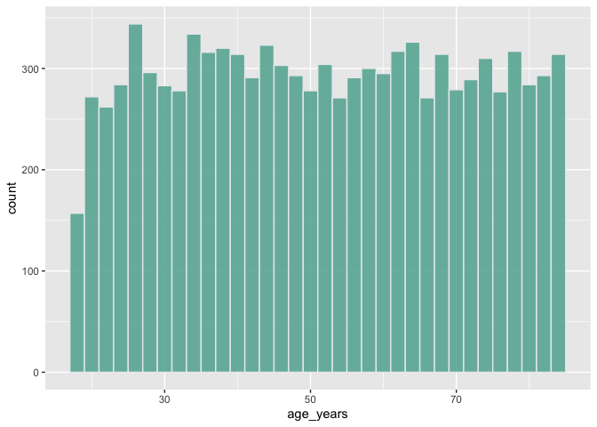
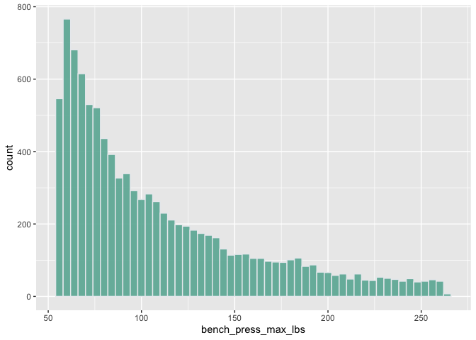
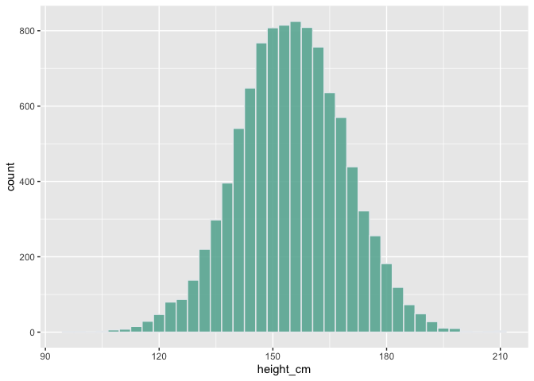
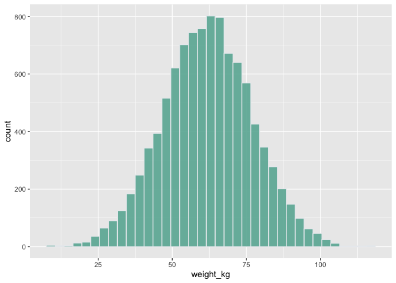
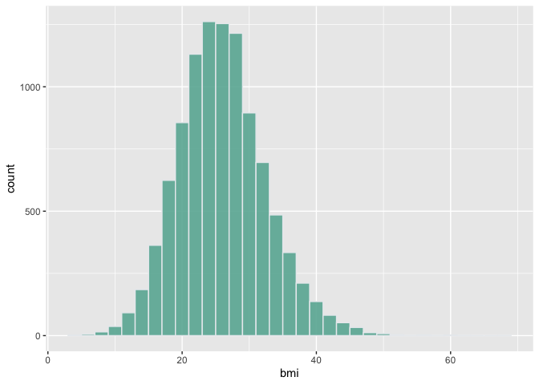
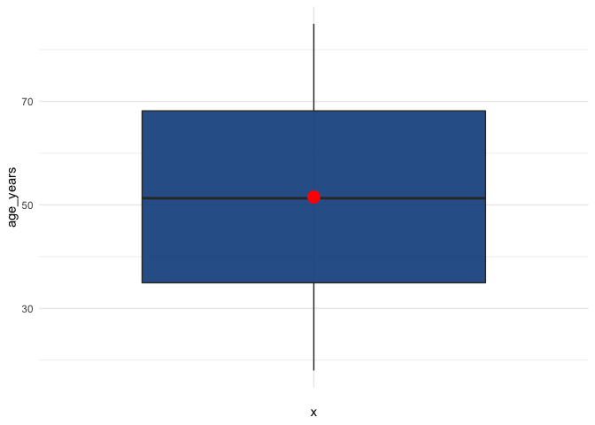
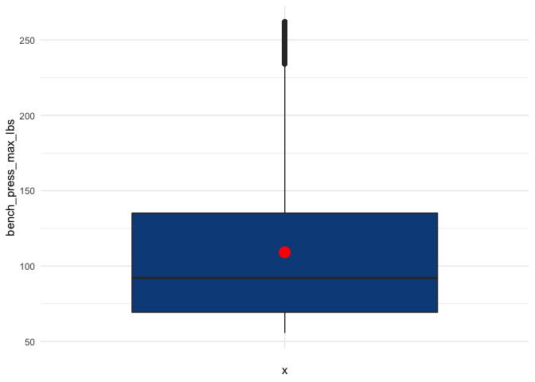
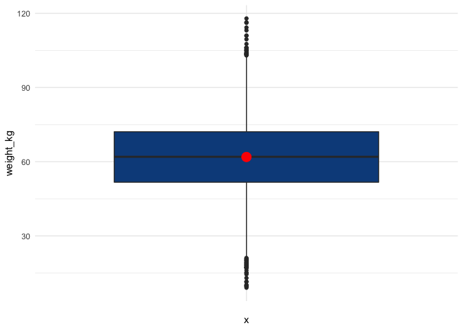
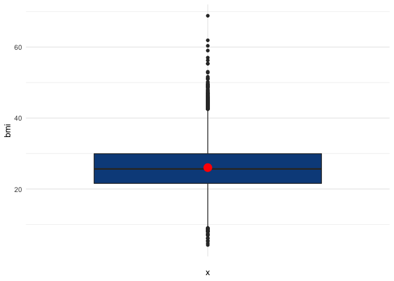
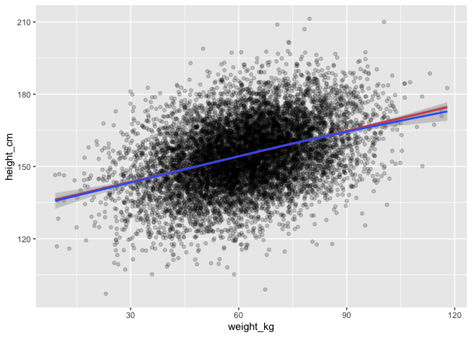

### Reading in the simulated data


```r
df <- read.csv("simulated_data_explore.csv")
head(df, 5)
```

<div class="kable-table">

| id| age_years| bench_press_max_lbs| height_cm| weight_kg|
|--:|---------:|-------------------:|---------:|---------:|
|  1|  38.62033|           122.34489|  161.0401|  54.07658|
|  2|  35.26406|           133.98912|  151.7275|  24.98297|
|  3|  55.00560|            85.90034|  160.7133|  55.13407|
|  4|  21.77767|           216.96535|  147.2229|  65.85491|
|  5|  49.39280|            95.66171|  145.1975|  67.43110|

</div>

### Changing the type of variable "id"


```r
df$id <- as.character(df$id)
```

## 1. Identify the variable types for each variable in the dataset by taking a glimpse of the data


```r
glimpse(df)
```

```
## Rows: 10,000
## Columns: 5
## $ id                  <chr> "1", "2", "3", "4", "5", "6", "7", "8", "9", "10",…
## $ age_years           <dbl> 38.62033, 35.26406, 55.00560, 21.77767, 49.39280, …
## $ bench_press_max_lbs <dbl> 122.34489, 133.98912, 85.90034, 216.96535, 95.6617…
## $ height_cm           <dbl> 161.0401, 151.7275, 160.7133, 147.2229, 145.1975, …
## $ weight_kg           <dbl> 54.07658, 24.98297, 55.13407, 65.85491, 67.43110, …
```

1. id 
      * Definition - a variable that identifies each participant.
      * Type - Qualitative, Categorical, Nominal
2. age_years
      * Definition - age of the participants in years.
      * Type - Quantitative, Numerical, Continuous
3. bench_press_max_lbs 
      * Definition - a measure of the maximal weight a subject can lift with one repetition, using the bench press exercise, in pounds.
      * Type - Quantitative, Numerical, Continuous
4. height_cm 
      * Definition - height of the participants in centimeters.
      * Type - Quantitative, Numerical, Continuous
5. weight_kg
      * Definition - weight of the participants in kilograms.
      * Type - Quantitative, Numerical, Continuous
        
## 2. Calculate the BMI for each participant

Body Mass Index (BMI) is a person's weight in kilograms divided by the square of height in meters


```r
df <- df %>% 
  mutate(bmi = weight_kg/((height_cm/100)^2))
```

## 3. Calculate a young and old variable as per data dictionary


```r
df <- df %>%
          mutate(age_category = case_when(
            age_years < 40 ~ "young", 
            age_years >= 40 ~ "old", 
          ))
glimpse(df)
```

```
## Rows: 10,000
## Columns: 7
## $ id                  <chr> "1", "2", "3", "4", "5", "6", "7", "8", "9", "10",…
## $ age_years           <dbl> 38.62033, 35.26406, 55.00560, 21.77767, 49.39280, …
## $ bench_press_max_lbs <dbl> 122.34489, 133.98912, 85.90034, 216.96535, 95.6617…
## $ height_cm           <dbl> 161.0401, 151.7275, 160.7133, 147.2229, 145.1975, …
## $ weight_kg           <dbl> 54.07658, 24.98297, 55.13407, 65.85491, 67.43110, …
## $ bmi                 <dbl> 20.85168, 10.85214, 21.34599, 30.38346, 31.98467, …
## $ age_category        <chr> "young", "young", "old", "young", "old", "old", "o…
```

## 4. Calculate the mean and standard deviation for the variables where it is appropriate, including the new variables

### Mean and SD of Age in Years


```r
mean(df$age_years)
```

```
## [1] 51.51981
```

```r
sd(df$age_years)
```

```
## [1] 19.27264
```

The mean age is 51 years. This sample is not representative of the population, as it is slightly older than the median age of the resident population in Newfoundland and Labrador, which is 47.4 years (https://www.statista.com/statistics/444816/canada-median-age-of-resident-population-by-province/).

The standard deviation is about 37% of the mean age, making the data values a bit closely spread to the mean, but might not be so reliable.

### Mean and SD of Bench Press Max in Pounds


```r
mean(df$bench_press_max_lbs)
```

```
## [1] 109.134
```

```r
sd(df$bench_press_max_lbs)
```

```
## [1] 50.4297
```

The mean is 109.134 pounds and standard deviation of 50, which shows that there is a large variation in the values of bench press max.  

### Mean and SD of height in Centimeters


```r
mean(df$height_cm)
```

```
## [1] 154.8626
```

```r
sd(df$height_cm)
```

```
## [1] 14.13637
```

The mean height is 154.86cm, which shows that the participants are averagely short. The sample mean height is not representative of the population considering that the average male and female human height in Canada is 178cm and 165cm (https://www.worlddata.info/average-bodyheight.php#by-population). The standard deviation is also small, shows that the sample values are closely spread around the mean.

### Mean and SD of weight in kilograms


```r
mean(df$weight_kg)
```

```
## [1] 61.90602
```

```r
sd(df$weight_kg)
```

```
## [1] 15.11361
```

The mean weight is 61.91kg, which is not representative of the population considering that the average male and female weight in Canada is 87.3kg and 72.4kg (https://www.worlddata.info/average-bodyheight.php#by-population). The standard deviation is relatively small, shows that the sample values are a bit closely spread around the mean.

### Mean and SD of bmi in kg/m^2


```r
mean(df$bmi)
```

```
## [1] 26.0272
```

```r
sd(df$bmi)
```

```
## [1] 6.556188
```

The body mass index is 26, which means that more of the participants are overweight (https://www.cdc.gov/healthyweight/assessing/bmi/adult_bmi/index.html). The sample data is representative of the population as the average bmi of a Canadian man and woman is 27.4 and 26.7 respectively (https://www.worlddata.info/average-bodyheight.php#by-population). The standard deviation is small, which shows that the sample values are closely spread around the mean.

## 5. Calculate the frequencies for the variables where it is appropriate to do so


```r
count(df,'age_category')
```

<div class="kable-table">

|age_category | freq|
|:------------|----:|
|old          | 6702|
|young        | 3298|

</div>

## 6. Draw the histogram and discuss the normality of the data

### Histogram of Age

<!-- -->

Age appears to be mostly a uniform distribution with nearly an equal number of people across age categories in the sample.

### Histogram of Bench Press Max

<!-- -->

Bench Press Max gives a Count type or Poisson distribution with each participant having their bench press max across the sample.

### Histogram of Height

<!-- -->

Height gives a normal distribution, the values are widely spread out.

### Histogram of Weight

<!-- -->

Weight gives a normal distribution, the values are widely spread out.

### Histogram of BMI

<!-- -->

BMI gives a normal distribution but is somewhat leptokurtic. The values are closely spread to the mean. 

## 7. Are there missing data


```r
map(df, ~sum(is.na(.)))
```

```
## $id
## [1] 0
## 
## $age_years
## [1] 0
## 
## $bench_press_max_lbs
## [1] 0
## 
## $height_cm
## [1] 0
## 
## $weight_kg
## [1] 0
## 
## $bmi
## [1] 0
## 
## $age_category
## [1] 0
```
There is no missing data in the sample, across all the variables.

## 8. Are there outliers?

A boxplot summarizes the distribution of a continuous variable and notably displays the median and potential outliers in the variable. The mean has been included in the plot with the use of red circle for better comparison.

### Boxplot for Age


```r
age_outlier <- ggplot(df) +
  aes(x = "", y = age_years) +
  geom_boxplot(fill = "#0c4c8a", alpha = 0.9) +
  stat_summary(fun=mean, geom="point", shape=20, size=7, color="red", fill="red") +
  theme_minimal()
age_outlier
```

<!-- -->

The box plot shows no evidence of outliers in the age.

### Boxplot for Height


```r
height_outlier <- ggplot(df) +
  aes(x = "", y = height_cm) +
  geom_boxplot(fill = "#0c4c8a") +
  stat_summary(fun=mean, geom="point", shape=20, size=7, color="red", fill="red") +
  theme_minimal()
height_outlier
```

<!-- -->

There are a number of potential outliers below and above the minimum and maximum for height.

### Boxplot for Bench press max


```r
bench_press_outlier <- ggplot(df) +
  aes(x = "", y = bench_press_max_lbs) +
  geom_boxplot(fill = "#0c4c8a") +
  stat_summary(fun=mean, geom="point", shape=20, size=7, color="red", fill="red") +
  theme_minimal()
bench_press_outlier
```

<!-- -->

For bench press max, there are potential outliers above the maximum.

### Boxplot for weight


```r
weight_outlier <- ggplot(df) +
  aes(x = "", y = weight_kg) +
  geom_boxplot(fill = "#0c4c8a") +
  stat_summary(fun=mean, geom="point", shape=20, size=7, color="red", fill="red") +
  theme_minimal()
weight_outlier
```

<!-- -->

There is evidence of outliers above and below the mimum and maximum for weight.

### Boxplot for BMI


```r
bmi_outlier <- ggplot(df) +
  aes(x = "", y = bmi) +
  geom_boxplot(fill = "#0c4c8a") +
  stat_summary(fun=mean, geom="point", shape=20, size=7, color="red", fill="red") +
  theme_minimal()
bmi_outlier
```

<!-- -->

Potential outliers are evident in the boxplot for BMI.


```r
height_weight_scatter <- ggplot(df) +
  aes(x = weight_kg, y = height_cm) +
  geom_point(alpha = 0.2) +
  stat_smooth(method = "lm", color = "red") +
  geom_smooth()
height_weight_scatter
```

```
## `geom_smooth()` using formula 'y ~ x'
```

```
## `geom_smooth()` using method = 'gam' and formula 'y ~ s(x, bs = "cs")'
```

<!-- -->


