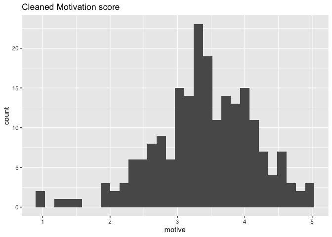
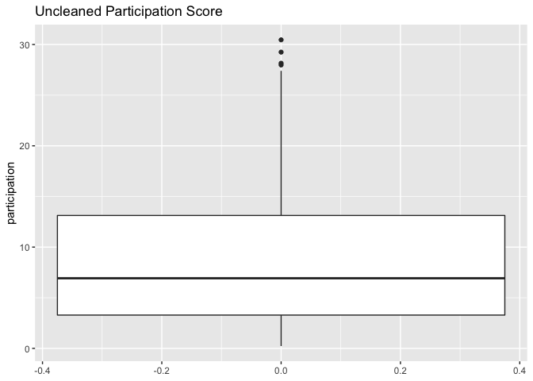

## Research Question
What is the relationship between exercise motivation, self efficacy and the level of participation in leisure physical activity of older adults?

## Research design and variables
Quantitative Research Design - A cross-sectional study.
Variables are:
* Motivation to exercise
* Exercise self efficacy, and
* Physically active leisure

## Analysis and Results
### Part 1 - Descriptive Statistics

#### Reading in the data


```r
data <- read.csv("ExerciseAdherance_OlderAdults.csv")
```

#### Print the data object


```r
glimpse(data)
```

```
## Rows: 219
## Columns: 5
## $ participation <dbl> 5.5384615, 12.0000000, 1.0384615, 1.7307692, 8.8846154, …
## $ barriers      <dbl> 2.555089, 2.312792, 2.349556, 2.828665, 1.852474, 1.8113…
## $ motive        <dbl> 3.944444, 3.333333, 3.000000, 2.666667, 3.055556, 4.2222…
## $ efficacy      <dbl> 58.86111, 80.52381, 64.98016, NA, 49.70833, 74.97619, 81…
## $ id            <int> 1, 2, 3, 4, 5, 6, 7, 8, 9, 10, 11, 12, 13, 14, 15, 16, 1…
```

#### Changing the type of variable "id"


```r
data$id <- as.character(data$id)
```

## Variable - Motivation to Exercise


```r
describe(data$motive)
```

<div class="kable-table">

|   | vars|   n|     mean|        sd|   median|  trimmed|       mad| min| max| range|       skew|  kurtosis|        se|
|:--|----:|---:|--------:|---------:|--------:|--------:|---------:|---:|---:|-----:|----------:|---------:|---------:|
|X1 |    1| 209| 3.405237| 0.7434189| 3.416667| 3.432117| 0.7001167|   1|   5|     4| -0.4576419| 0.5138294| 0.0514234|

</div>

The mean motivation score is 3.41, which suggests that on average, the motivation of older adults to exercise is on the medium side. The standard deviation is 0.74, the scores are closely spread around the mean.
The standard error of the mean is 0.05, this shows that the mean is representative of the motivation score of older adults in NL.

## Exploratory Data Analysis


```r
hist_motive <- ggplot(data = data, aes(motive)) + 
                  geom_histogram() +
                ggtitle("Histogram of Uncleaned Motivation")
plot(hist_motive)
```

```
## `stat_bin()` using `bins = 30`. Pick better value with `binwidth`.
```

```
## Warning: Removed 10 rows containing non-finite values (stat_bin).
```

<!-- -->

The distribution is negatively skewed as the skewness is -0.46, which indicates that majority of the participants have medium motivation to exercise.The kurtosis is 0.51, indicates mesokurtic.

Let's plot a boxplot


```r
box_motive <- ggplot(data = data, aes(motive)) + 
                  geom_boxplot() +
                  ggtitle("Uncleaned Motivation Score") +
                  coord_flip()
plot(box_motive)
```

```
## Warning: Removed 10 rows containing non-finite values (stat_boxplot).
```

<!-- -->
Outliers are visible below the minimum of the boxplot, but they are closer to the IQR of the boxplot, we are going to leave them.

Let's arrange in ascending order to see the exact values of these potential outliers


```r
head(arrange(data, motive), 10)
```

<div class="kable-table">

| participation| barriers|   motive| efficacy|id  |
|-------------:|--------:|--------:|--------:|:---|
|     6.9230769| 1.780696| 1.000000| 66.25000|196 |
|     0.9230769| 2.103175| 1.000000| 53.33333|198 |
|     6.0576923| 2.452614| 1.305556|       NA|53  |
|     1.0384615| 3.621499| 1.333333| 43.47222|17  |
|     1.3846154| 2.881769| 1.555556| 69.67460|40  |
|     6.0000000| 2.426937| 1.888889| 50.48148|185 |
|     3.1153846| 2.156163| 1.916667| 75.00000|200 |
|     9.8653846| 3.691293| 2.000000| 62.25794|140 |
|     2.4807692| 2.287348| 2.111111| 45.00000|188 |
|     1.8461538| 2.015173| 2.111111| 68.45238|219 |

</div>

The values are still within range, so we are keeping the scores.


```r
summary(data$motive)
```

```
##    Min. 1st Qu.  Median    Mean 3rd Qu.    Max.    NA's 
##   1.000   3.000   3.417   3.405   3.917   5.000      10
```

The summary statistics show that there are 10 missing values in the motivation score. This is less than 5% of the total number of observations, so we will drop them.

### Removing missing data


```r
motive_cleaned_data <- drop_na(data, motive)
```

Compare the distribution histogram


```r
#histogram
hist_motive_cleaned <- ggplot(data = motive_cleaned_data, aes(motive)) + 
                  geom_histogram() +
                  ggtitle("Cleaned Motivation score")
#histogram for outlier-cleaned data
plot(hist_motive_cleaned) 
```

```
## `stat_bin()` using `bins = 30`. Pick better value with `binwidth`.
```

<!-- -->

```r
#histogram for uncleaned data
plot(hist_motive) 
```

```
## `stat_bin()` using `bins = 30`. Pick better value with `binwidth`.
```

```
## Warning: Removed 10 rows containing non-finite values (stat_bin).
```

<!-- -->

There is little to no change in the histogram.

## Variable - Self Efficacy


```r
describe(motive_cleaned_data$efficacy)
```

<div class="kable-table">

|   | vars|   n|     mean|       sd|   median| trimmed|      mad|      min| max|    range|       skew|  kurtosis|       se|
|:--|----:|---:|--------:|--------:|--------:|-------:|--------:|--------:|---:|--------:|----------:|---------:|--------:|
|X1 |    1| 185| 65.68545| 13.80511| 65.68651| 66.0252| 14.09647| 15.66667| 100| 84.33333| -0.3285902| 0.3741703| 1.014972|

</div>
The mean self efficacy score is 65.69, which suggests that on average, the confidence of older adults in their ability to exercise is slightly high. The standard deviation is 13.81, the scores are widely spread around the mean.
The standard error of the mean is 1.01, slightly above 1, this shows that the mean is  roughly representative of the self efficacy score of older adults in NL.


```r
hist_efficacy <- ggplot(data = motive_cleaned_data, aes(efficacy)) + 
                  geom_histogram() +
                ggtitle("Histogram of Uncleaned Self Efficacy")
plot(hist_efficacy)
```

```
## `stat_bin()` using `bins = 30`. Pick better value with `binwidth`.
```

```
## Warning: Removed 24 rows containing non-finite values (stat_bin).
```

<!-- -->
The distribution is negatively skewed as the skewness is -0.33, which indicates that majority of the participants have medium self efficacy to exercise.The kurtosis is 0.37, indicates mesokurtic. There is also the presence of outliers.

Let's plot a boxplot to view the outlier.


```r
box_efficacy <- ggplot(data = motive_cleaned_data, aes(efficacy)) + 
                  geom_boxplot() +
                  ggtitle("Uncleaned Self Efficacy Score") +
                  coord_flip()
plot(box_efficacy)
```

```
## Warning: Removed 24 rows containing non-finite values (stat_boxplot).
```

<!-- -->
One potential outlier below the minimum of the boxplot.

Arrange in descending order to view the exact value of the score.


```r
head(arrange(motive_cleaned_data, (efficacy)), 10)
```

<div class="kable-table">

| participation| barriers|   motive| efficacy|id  |
|-------------:|--------:|--------:|--------:|:---|
|    12.1730769| 2.096172| 2.777778| 15.66667|44  |
|     0.4615385| 3.583217| 2.777778| 28.58333|23  |
|     5.8846154| 2.399860| 3.250000| 30.84722|151 |
|     2.1346154| 2.504318| 3.138889| 34.46825|187 |
|     6.0000000| 3.398343| 3.333333| 34.75926|156 |
|     8.8269231| 2.800537| 3.944444| 40.88095|72  |
|    23.9423077| 1.914332| 3.250000| 41.00331|149 |
|     1.2115385| 3.214519| 2.333333| 41.33333|175 |
|    13.3846154| 2.120682| 2.555556| 43.20040|183 |
|     2.7115385| 2.377101| 3.777778| 43.25397|45  |

</div>

The lowest score is 15%, and it is far away from the next score of 28%. We will remove any score below 28.


```r
efficacy_no_outliers <- filter(motive_cleaned_data, is.na(efficacy) | efficacy > 16)
```

Compare the boxplots afterwards,


```r
#boxplots
box_efficacy_no_outlier <- ggplot() + 
                  geom_boxplot(data = efficacy_no_outliers, aes(efficacy)) +
                  ggtitle("Outlier-Cleaned Self efficacy") +
                  coord_flip()
#boxplot for outlier-cleaned data
plot(box_efficacy_no_outlier) 
```

```
## Warning: Removed 24 rows containing non-finite values (stat_boxplot).
```

<!-- -->

```r
#boxplot for uncleaned data
plot(box_efficacy) 
```

```
## Warning: Removed 24 rows containing non-finite values (stat_boxplot).
```

<!-- -->


```r
summary(efficacy_no_outliers$efficacy)
```

```
##    Min. 1st Qu.  Median    Mean 3rd Qu.    Max.    NA's 
##   28.58   56.55   65.69   65.96   75.29  100.00      24
```

There are 24 missing values. This is a large number, about 15% of the total dataset. We will replace the missing values with the median score of 65.69 instead.


```r
efficacy_cleaned_data <- efficacy_no_outliers %>%
        mutate(efficacy = replace(efficacy,
                                  is.na(efficacy),
                                  median(efficacy, na.rm = TRUE)))
```


```r
summary(efficacy_cleaned_data$efficacy)
```

```
##    Min. 1st Qu.  Median    Mean 3rd Qu.    Max. 
##   28.58   57.52   65.69   65.93   74.30  100.00
```

Compare the distribution - histogram


```r
#histogram
hist_efficacy_cleaned <- ggplot(data = efficacy_cleaned_data, aes(efficacy)) + 
                  geom_histogram() +
                  ggtitle("Cleaned Self efficacy Score")
#histogram for outlier-cleaned data
plot(hist_efficacy_cleaned) 
```

```
## `stat_bin()` using `bins = 30`. Pick better value with `binwidth`.
```

<!-- -->

```r
#histogram for uncleaned data
plot(hist_efficacy) 
```

```
## `stat_bin()` using `bins = 30`. Pick better value with `binwidth`.
```

```
## Warning: Removed 24 rows containing non-finite values (stat_bin).
```

<!-- -->

## Variable - Participation


```r
describe(efficacy_cleaned_data$participation)
```

<div class="kable-table">

|   | vars|   n|     mean|       sd|   median|  trimmed|      mad|       min|      max|    range|      skew| kurtosis|        se|
|:--|----:|---:|--------:|--------:|--------:|--------:|--------:|---------:|--------:|--------:|---------:|--------:|---------:|
|X1 |    1| 208| 8.892243| 6.968179| 6.923077| 8.109947| 6.800002| 0.2307692| 30.46154| 30.23077| 0.9468691| 0.202457| 0.4831563|

</div>
The mean participation score is 8.89, which suggests that on average, the confidence of older adults in their ability to exercise is really low. The standard deviation is 6.97, whis is more than half the mean, it indicates that the scores are widely spread around the mean.
The standard error of the mean is 0.48, this shows that the mean is slightly representative of the partipation in physical activity score of older adults in NL.


```r
hist_participation <- ggplot(data = efficacy_cleaned_data, aes(participation)) + 
                  geom_histogram() +
                ggtitle("Histogram of Uncleaned Participation")
plot(hist_participation)
```

```
## `stat_bin()` using `bins = 30`. Pick better value with `binwidth`.
```

<!-- -->
The distribution is positively skewed, most of the participants lie at the lower end of the participation score.

A boxplot to view outliers.


```r
box_participation <- ggplot(data = efficacy_cleaned_data, aes(participation)) + 
                  geom_boxplot() +
                  ggtitle("Uncleaned Participation Score") +
                  coord_flip()
plot(box_participation)
```

<!-- -->
Four potential outliers above the maximum, but they are within 1.5 the IQR.

Arrange in descending order to view the exact values of the outliers


```r
head(arrange(efficacy_cleaned_data, desc(participation)), 10)
```

<div class="kable-table">

| participation| barriers|   motive| efficacy|id  |
|-------------:|--------:|--------:|--------:|:---|
|      30.46154| 2.001167| 4.166667| 63.60000|15  |
|      29.25000| 2.718604| 4.222222| 70.91270|143 |
|      28.15385| 1.959967| 3.916667| 65.69048|22  |
|      27.98077| 2.148226| 3.444444| 77.77778|129 |
|      27.40385| 2.281396| 3.333333| 63.53333|120 |
|      25.26923| 2.919351| 4.000000| 78.88889|78  |
|      25.03846| 2.572596| 3.500000| 78.11243|83  |
|      24.23077| 2.217320| 3.361111| 58.58201|127 |
|      23.94231| 1.914332| 3.250000| 41.00331|149 |
|      23.25000| 3.386438| 4.166667| 75.81349|81  |

</div>

The values are still in range, so we will include them as part of our analysis.


```r
summary(efficacy_cleaned_data$participation)
```

```
##    Min. 1st Qu.  Median    Mean 3rd Qu.    Max. 
##  0.2308  3.2885  6.9231  8.8922 13.1250 30.4615
```

There are no missing values in participation.

## MULTIPLE REGRESSION


```r
summary(efficacy_cleaned_data, quantile.type = 1)
```

```
##  participation        barriers         motive         efficacy     
##  Min.   : 0.2308   Min.   :1.000   Min.   :1.000   Min.   : 28.58  
##  1st Qu.: 3.2885   1st Qu.:1.960   1st Qu.:3.000   1st Qu.: 57.28  
##  Median : 6.9231   Median :2.305   Median :3.417   Median : 65.69  
##  Mean   : 8.8922   Mean   :2.348   Mean   :3.408   Mean   : 65.93  
##  3rd Qu.:13.0385   3rd Qu.:2.732   3rd Qu.:3.917   3rd Qu.: 74.18  
##  Max.   :30.4615   Max.   :3.691   Max.   :5.000   Max.   :100.00  
##       id           
##  Length:208        
##  Class :character  
##  Mode  :character  
##                    
##                    
## 
```
### Correlation coefficients


```r
df <- efficacy_cleaned_data

df %>% select(participation, motive, efficacy) %>%
        cor()
```

```
##               participation    motive  efficacy
## participation     1.0000000 0.2669992 0.1091534
## motive            0.2669992 1.0000000 0.2100499
## efficacy          0.1091534 0.2100499 1.0000000
```

The correlation coefficient of Participation to motivation is 0.267. This indicates a weak positive linear relationship.

Participation to efficacy is 0.109, which is suggestive of another positive, but weak relationship, which is not as strong as motivation.

The correlation coefficient of the two predictor variables (Motivation and Self efficacy), is 0.21. The degree of multicollinearity is really low. We can't make a pretty good guess of someone's self efficacy to exercise if we knew their level of motivation.

### Scatterplots


```r
ggplot(df, aes(x = motive, y = participation)) +
        geom_point() +
        labs(x = "Motivation to Exercise", y = "Participation", title = "Scatterplot motivation by partipation and a regression line") +
        geom_smooth(method = "lm", formula = y ~ x)
```

<!-- -->

This supports the earlier positive correlation coefficient we got earlier. An increse in motivation, leads to an increase in participation.


```r
ggplot(df, aes(x = efficacy, y = participation)) +
        geom_point() +
        labs(x = "Exercise Self Efficacy", y = "Participation", title = "Scatterplot self efficacy by partipation and a regression line") +
        geom_smooth(method = "lm", formula = y ~ x)
```

<!-- -->

### Fit Multiple Regression Model


```r
partic_model <- lm(participation ~ motive + efficacy, data = df)
# Get regression table:
get_regression_table(partic_model)
```

<div class="kable-table">

|term      | estimate| std_error| statistic| p_value| lower_ci| upper_ci|
|:---------|--------:|---------:|---------:|-------:|--------:|--------:|
|intercept |   -1.293|     3.009|    -0.430|   0.668|   -7.225|    4.639|
|motive    |    2.392|     0.644|     3.715|   0.000|    1.122|    3.661|
|efficacy  |    0.031|     0.038|     0.808|   0.420|   -0.044|    0.106|

</div>

The method of regression used was the hierarchical 


```r
summary(partic_model)
```

```
## 
## Call:
## lm(formula = participation ~ motive + efficacy, data = df)
## 
## Residuals:
##    Min     1Q Median     3Q    Max 
## -9.795 -5.155 -1.780  3.639 19.827 
## 
## Coefficients:
##             Estimate Std. Error t value Pr(>|t|)    
## (Intercept) -1.29303    3.00864  -0.430 0.667813    
## motive       2.39167    0.64381   3.715 0.000262 ***
## efficacy     0.03085    0.03819   0.808 0.420171    
## ---
## Signif. codes:  0 '***' 0.001 '**' 0.01 '*' 0.05 '.' 0.1 ' ' 1
## 
## Residual standard error: 6.737 on 205 degrees of freedom
## Multiple R-squared:  0.07424,	Adjusted R-squared:  0.0652 
## F-statistic: 8.219 on 2 and 205 DF,  p-value: 0.0003684
```

```r
confint(partic_model)
```

```
##                   2.5 %    97.5 %
## (Intercept) -7.22487715 4.6388176
## motive       1.12232940 3.6610171
## efficacy    -0.04445084 0.1061512
```


```r
plot(partic_model)
```

<!-- --><!-- --><!-- --><!-- -->

* The Cook's distance is not up to 1, whch means that the effect of a single observation on our model is not much.

* The variance at each level of the residuals seems constant which signifies Homoscedasticity.

* The Multiple R-squared is 0.07424,and the Adjusted R-squared is 0.0652, these values are really small, which shows that the line is representative of the data.

* The F-ratio is 8.219 on 2 and 205 degree of freedom, and the p-value: 0.0003684, the f-ratio is really large which shows that the linear model is a good model.

* The estimate of motivation is 2.392, which indicates that for every unit increase in motivation to exercise, there is an associated increase, on average, of 2.392 unit of participation score.

For self efficacy, the estimate is 0.031, for every unit increase in self efficacy score, there is 0.031 unit of increase in participation score.

* Standard error of motivation is 0.344 which suggests that we can expect about 0.344 units of variation in the motivation score of the population.

Standard error of self efficacy is 0.038, which suggests that we can expect about 0.038 units of variation in the self efficacy score of the population.

* The p-value of motivation is 0, which means that we reject the null hypothesis that there is no relationship between motivation and participation. It indicates that there is a significant positive relationship between the motivation to exercise and participation in physical activity.

The p-value of self efficacy is 0.42 which is high (> 0.05), which means that we accept the null hypothesis that there is no relationship between self efficacy and participation.

* The confidence interval of motivation means that we are 95% ‘confident’ that the true population slope lies between 1.12 and 3.66.

The confidence interval of self efficacy means that we are 95% ‘confident’ that the true population slope lies between -0.04 and 0.11. This is closer to zero, which means that the true population slope will be 0, to show that there is no relationship between self efficacy and participation.

* There exists an independence in the residuals between observations, as each participant's id is unique, and we assume that the score of a participant does not affect the score of another, therefore the condition of independence is met.


```r
regression_points <- get_regression_points(partic_model)
```


```r
ggplot(regression_points, aes(x = residual)) +
  geom_histogram() +
  labs(x = "Residual")
```

```
## `stat_bin()` using `bins = 30`. Pick better value with `binwidth`.
```

<!-- -->

This histogram shows that we have more negative residuals than positive, and there is a slight right-skew.


