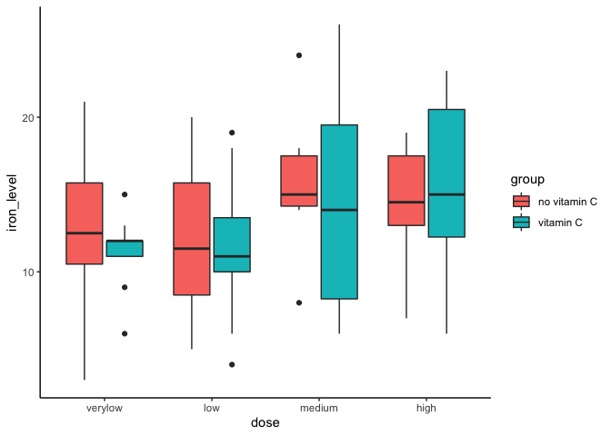
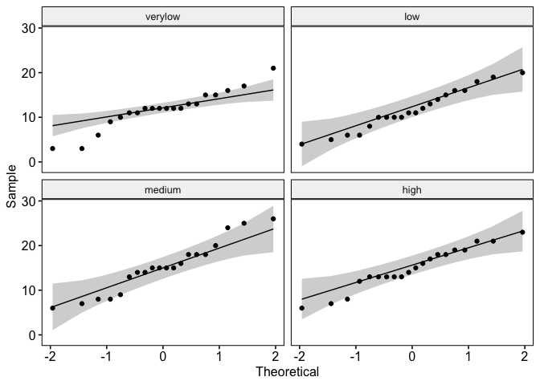
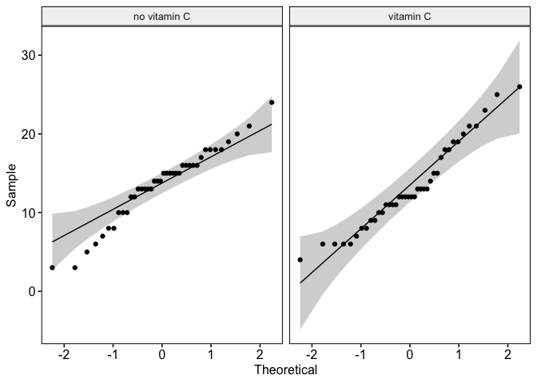
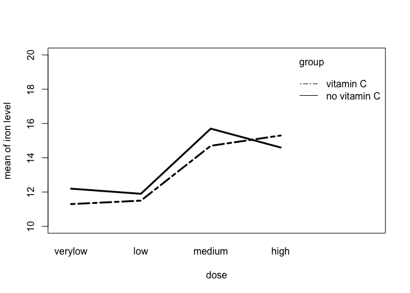

```r
iron_data <- read.csv("RM_ANOVA.csv")
head(iron_data,6)
```

<div class="kable-table">

| id|group        |dose    | iron_level|
|--:|:------------|:-------|----------:|
|  1|no vitamin C |verylow |         15|
|  2|no vitamin C |verylow |          3|
|  3|no vitamin C |verylow |          3|
|  4|no vitamin C |verylow |         17|
|  5|no vitamin C |verylow |         13|
|  6|no vitamin C |verylow |         12|

</div>


```r
glimpse(iron_data)
```

```
## Rows: 80
## Columns: 4
## $ id         <int> 1, 2, 3, 4, 5, 6, 7, 8, 9, 10, 11, 12, 13, 14, 15, 16, 17, …
## $ group      <chr> "no vitamin C", "no vitamin C", "no vitamin C", "no vitamin…
## $ dose       <chr> "verylow", "verylow", "verylow", "verylow", "verylow", "ver…
## $ iron_level <int> 15, 3, 3, 17, 13, 12, 21, 10, 16, 12, 11, 12, 9, 13, 12, 11…
```


```r
iron_data$id <- as.factor(iron_data$id)
```


```r
names(iron_data)[1] <- "id"
head(iron_data)
```

<div class="kable-table">

|id |group        |dose    | iron_level|
|:--|:------------|:-------|----------:|
|1  |no vitamin C |verylow |         15|
|2  |no vitamin C |verylow |          3|
|3  |no vitamin C |verylow |          3|
|4  |no vitamin C |verylow |         17|
|5  |no vitamin C |verylow |         13|
|6  |no vitamin C |verylow |         12|

</div>


```r
iron_data$group <- fct_relevel(iron_data$group, c("no vitamin C", "vitamin C"))
iron_data$dose <- fct_relevel(iron_data$dose, c("verylow", "low", "medium", "high"))
```


```r
stat.desc(iron_data$iron_level)
```

```
##      nbr.val     nbr.null       nbr.na          min          max        range 
##   80.0000000    0.0000000    0.0000000    3.0000000   26.0000000   23.0000000 
##          sum       median         mean      SE.mean CI.mean.0.95          var 
## 1072.0000000   13.0000000   13.4000000    0.5688652    1.1322978   25.8886076 
##      std.dev     coef.var 
##    5.0880849    0.3797078
```

The grand mean iron level is 13.4, standard deviation is 5.09, and standard error is 0.57.


```r
iron_data %>%
  group_by(group,dose) %>%
  get_summary_stats(iron_level, type = "mean_sd")
```

<div class="kable-table">

|group        |dose    |variable   |  n| mean|    sd|
|:------------|:-------|:----------|--:|----:|-----:|
|no vitamin C |verylow |iron_level | 10| 12.2| 5.750|
|no vitamin C |low     |iron_level | 10| 11.9| 4.886|
|no vitamin C |medium  |iron_level | 10| 15.7| 4.029|
|no vitamin C |high    |iron_level | 10| 14.6| 3.502|
|vitamin C    |verylow |iron_level | 10| 11.3| 2.406|
|vitamin C    |low     |iron_level | 10| 11.5| 4.673|
|vitamin C    |medium  |iron_level | 10| 14.7| 7.364|
|vitamin C    |high    |iron_level | 10| 15.3| 5.794|

</div>
The mean of 

```r
grp_box <- ggplot(iron_data, aes(x = dose, y = iron_level, fill = group)) +
            geom_boxplot() +
            theme_classic()
plot(grp_box)
```

<!-- -->


```r
iron_data %>%
  group_by(dose) %>%
  identify_outliers(iron_level)
```

<div class="kable-table">

|dose    |id |group        | iron_level|is.outlier |is.extreme |
|:-------|:--|:------------|----------:|:----------|:----------|
|verylow |2  |no vitamin C |          3|TRUE       |FALSE      |
|verylow |3  |no vitamin C |          3|TRUE       |FALSE      |
|verylow |7  |no vitamin C |         21|TRUE       |FALSE      |
|verylow |19 |vitamin C    |          6|TRUE       |FALSE      |

</div>

There is no extreme outlier in the data.


```r
iron_data %>%
  group_by(dose,group) %>%
  shapiro_test(iron_level)
```

<div class="kable-table">

|group        |dose    |variable   | statistic|         p|
|:------------|:-------|:----------|---------:|---------:|
|no vitamin C |verylow |iron_level | 0.9289554| 0.4376966|
|vitamin C    |verylow |iron_level | 0.8918238| 0.1777724|
|no vitamin C |low     |iron_level | 0.9574814| 0.7568166|
|vitamin C    |low     |iron_level | 0.9490869| 0.6577092|
|no vitamin C |medium  |iron_level | 0.9013494| 0.2266846|
|vitamin C    |medium  |iron_level | 0.9167372| 0.3305431|
|no vitamin C |high    |iron_level | 0.9075429| 0.2645364|
|vitamin C    |high    |iron_level | 0.9404990| 0.5585792|

</div>

The iron level score was normally distributed at each dose level, as assessed by Shapiro Wilk's test (p>0.05)


```r
ggqqplot(iron_data, "iron_level", facet.by = "dose")
```

<!-- -->

```r
ggqqplot(iron_data, "iron_level", facet.by = "group")
```

<!-- -->

From the plot above, as all the points fall approximately along the reference line, we can assume normality of the data.


```r
with(iron_data, interaction.plot(dose, group, iron_level,
  ylim = c(10, 20), lty = c(1, 12), lwd = 3,
  ylab = "mean of iron level", xlab = "dose", trace.label = "group"))
```

<!-- -->
From the interaction plot above, 


```r
rm_aov <- aov(iron_level ~ group*dose, data = iron_data)
summary(rm_aov)
```

```
##             Df Sum Sq Mean Sq F value Pr(>F)  
## group        1    3.2    3.20   0.127 0.7221  
## dose         3  225.1   75.03   2.988 0.0366 *
## group:dose   3    9.1    3.03   0.121 0.9476  
## Residuals   72 1807.8   25.11                 
## ---
## Signif. codes:  0 '***' 0.001 '**' 0.01 '*' 0.05 '.' 0.1 ' ' 1
```

The iron level score was statistically significantly different at the different dose level, F(2.24, 42.47) = 4.73, p < 0.05, eta2[g] = 0.11.

The p value is less than 0.05 to show that there are significant differences between doses.

The generalized eta squared (effect size) is 0.11. It measures the proportion of the variability in the outcome variable (here iron level) that can be explained in terms of the predictor (here, amount of dose). An effect size of 0.11 means that 11% of the change in the iron level can be accounted for by the amount of dose.


```r
# Dose as factor
lm_model <- lm(iron_level ~ dose, data = iron_data)
summary(lm_model)
```

```
## 
## Call:
## lm(formula = iron_level ~ dose, data = iron_data)
## 
## Residuals:
##    Min     1Q Median     3Q    Max 
## -9.200 -1.950 -0.075  3.100 10.800 
## 
## Coefficients:
##             Estimate Std. Error t value Pr(>|t|)    
## (Intercept)   11.750      1.094  10.738   <2e-16 ***
## doselow       -0.050      1.548  -0.032   0.9743    
## dosemedium     3.450      1.548   2.229   0.0287 *  
## dosehigh       3.200      1.548   2.068   0.0421 *  
## ---
## Signif. codes:  0 '***' 0.001 '**' 0.01 '*' 0.05 '.' 0.1 ' ' 1
## 
## Residual standard error: 4.894 on 76 degrees of freedom
## Multiple R-squared:  0.1101,	Adjusted R-squared:  0.07493 
## F-statistic: 3.133 on 3 and 76 DF,  p-value: 0.03038
```
The medium dose estimate is 3.4, with p value of 0.03, means that a unit increase in the medium dose causes an increase of 3.45 in the blood iron levels.
The medium dose of iron supplement had the greatest increase in blood iron levels.


```r
# Group as factor
lm_bet_model <- lm(iron_level ~ group, data = iron_data)
summary(lm_bet_model)
```

```
## 
## Call:
## lm(formula = iron_level ~ group, data = iron_data)
## 
## Residuals:
##    Min     1Q Median     3Q    Max 
## -10.60  -3.30  -0.20   2.65  12.80 
## 
## Coefficients:
##                Estimate Std. Error t value Pr(>|t|)    
## (Intercept)      13.600      0.809   16.81   <2e-16 ***
## groupvitamin C   -0.400      1.144   -0.35    0.728    
## ---
## Signif. codes:  0 '***' 0.001 '**' 0.01 '*' 0.05 '.' 0.1 ' ' 1
## 
## Residual standard error: 5.117 on 78 degrees of freedom
## Multiple R-squared:  0.001565,	Adjusted R-squared:  -0.01124 
## F-statistic: 0.1222 on 1 and 78 DF,  p-value: 0.7276
```

The p value is 0.728 (p<0.05), which indicates that there is no difference in the blood levels by Vitamin C intake. 


```r
#post-hoc tests
pwc <- iron_data %>%
  pairwise_t_test(
    iron_level ~ dose, paired = TRUE,
    p.adjust.method = "bonferroni"
    )
pwc
```

<div class="kable-table">

|.y.        |group1  |group2 | n1| n2|  statistic| df|     p| p.adj|p.adj.signif |
|:----------|:-------|:------|--:|--:|----------:|--:|-----:|-----:|:------------|
|iron_level |verylow |low    | 20| 20|  0.0674281| 19| 0.947| 1.000|ns           |
|iron_level |verylow |medium | 20| 20| -2.4807443| 19| 0.023| 0.136|ns           |
|iron_level |verylow |high   | 20| 20| -2.2010501| 19| 0.040| 0.242|ns           |
|iron_level |low     |medium | 20| 20| -3.0728148| 19| 0.006| 0.038|*            |
|iron_level |low     |high   | 20| 20| -2.2894526| 19| 0.034| 0.202|ns           |
|iron_level |medium  |high   | 20| 20|  0.1970357| 19| 0.846| 1.000|ns           |

</div>

The result shows that the difference between the low and medium doses is statistically significant (p<0.05).


